.. _header-n0:

面向无人机蜂群的基于模型随机搜索的大规模优化问题
================================================

   Model-Based Stochastic Search for Large Scale Optimization of
   Multi-Agent UAV Swarms

``David D. Fan``, ``Evangelos Theodorou``, and ``John Reeder``

.. raw:: html

    <a href="https://arxiv.org/abs/1803.01106" class="fa fa-file-text" target="_blank"> View Publish Source</a>  
    <a href="https://github.com/hill68/ref/raw/master/00.ref/Model-Based%20Stochastic%20Search%20for%20Large%20Scale%20Optimization%20of%20Multi-Agent%20UAV%20Swarms.En-Ch.pdf" class="fa fa-file-pdf-o" download> Download PDF Version</a>  

.. _header-n6:

Abstract
---------

强化学习社区在近期的工作中体现了演化策略是一个速度快、可扩展的强化学习方案。本文将说明演化策略实际上是一个特殊的基于模型的随机搜索算法。这类算法有很好的渐进收敛性和可知的收敛率。

本文展示了这类方法可被有效地用于解决多智能体竞争和合作问题----如何模拟两个复杂的智能无人机群间的战斗情景：一个是一队固定翼无人机群攻击一个防御基地；另一个是两队无人机群面对面交锋来攻击对方。\ `演示视频 <http://goo.gl/dWvQi7>`__\

   Recent work from the reinforcement learning community has shown that
   Evolution Strategies are a fast and scalable alternative to other
   reinforcement learning methods. In this paper we show that Evolution
   Strategies are a special case of model-based stochastic search
   methods. This class of algorithms has nice asymptotic convergence
   properties and known convergence rates. We show how these methods can
   be used to solve both cooperative and competitive multi-agent
   problems in an efficient manner. We demonstrate the effectiveness of
   this approach on two complex multi-agent UAV swarm combat scenarios:
   where a team of fixed wing aircraft must attack a well-defended base,
   and where two teams of agents go head to head to defeat each
   other.Video at http://goo.gl/dWvQi7

.. _header-n11:

I.INTRODUCTION
--------------

强化学习关注的是通过反复的互动和试错来最大限度地提高环境的回报。
这些方法通常依赖于贝尔曼方程的各种近似，包括值函数逼近，策略梯度方法等 [1]_。
另一方面，Evolutionary
Computation社区开发了一套黑盒优化和启发式搜索方法 [2]_。
例如，已经使用这些方法来优化用于视觉任务的神经网络的结构 [3]_。

   Reinforcement Learning is concerned with maximizing rewards from an
   environment through repeated interactions and trial and error. Such
   methods often rely on various approximations of the Bellman equation
   and include value function approximation, policy gradient methods,
   and more  [1]_. The Evolutionary Computation community, on the other
   hand, have developed a suite of methods for black box optimization
   and heuristic search  [2]_. Such methods have been used to optimize
   the structure of neural networks for vision tasks, for instance [3]_.

最近，Salimans等人提出了进化计算方法的一种特殊变体，称为\ **进化策略(ES)**\，是其他强化学习方法的快速和可扩展的替代方案，可在10分钟内解决困难的类人的MuJoCo任务 [4]_。

   Recently, Salimans et al. have shown that a particular variant of
   evolutionary computation methods, termed Evolution Strategies (ES)
   are a fast and scalable alternative to other reinforcement learning
   approaches, solving the difficult humanoid MuJoCo task in 10 minutes [4]_.

作者认为ES与其他强化学习方法相比有几个好处：

1）避免了通过策略反向传播梯度的需要，这开辟了更广泛的策略参数化类别;

2）ES方法可以大规模并行化，这样可以将学习扩展到更大、更复杂的问题;

3）ES经常发现比其他强化学习方法更强大的政策;

4）ES在更长的时间尺度上更好地分配政策变化，这使得能够以更长的时间范围和稀疏的奖励来解决任务。

   The authors argue that ES has several benefits over other
   reinforcement learning methods: 1) The need to backpropagate
   gradients through a policy is avoided, which opens up a wider class
   of policy parameterizations; 2) ES methods are massively
   parallelizable, which allows for scaling up learning to larger, more
   complex problems; 3) ES often finds policies which are more robust
   than other reinforcement learning methods; and 4) ES are better at
   assigning credit to changes in the policy over longer timescales,
   which enables solving tasks with longer time horizons and sparse
   rewards.

在这项工作中，我们通过利用以下使用ES的这四个优势来解决问题：

1）一个更复杂和可判读的策略体系结构，允许出于安全考虑;

2）具有许多相互作用要素的大规模模拟环境;

3）多种随机性来源，包括初始条件、干扰等的变化;

4）稀疏的奖励只产生在长时间的模拟场景的最后。

   In this work we leverage all four of these advantages by using ES to
   solve a problem with: 1) a more complex and decipherable policy
   architecture which allows for safety considerations; 2) a large-scale
   simulated environment with many interacting elements; 3) multiple
   sources of stochasticity including variations in intial conditions,
   disturbances, etc.; and 4) sparse rewards which only occur at the
   very end of a long episode.

对进化计算算法的一种常见批评是缺乏收敛性分析或保证。
当然，对于具有不可微分和非凸目标函数的问题，分析将始终是困难的。
然而，我们证明 [4]_ 提出的进化策略算法是一类基于模型的随机搜索方法的特例，称为基于梯度的自适应随机搜索（GASS） [5]_。
这类方法推广了许多随机搜索方法，如众所周知的交叉熵方法（CEM） [6]_，CMA-ES [7]_ 等。通过将不可微分、非凸优化问题作为梯度下降问题，人们可以得到很好的渐近收敛性和已知的收敛速度 [8]_。

   A common critique of evolutionary computation algorithms is a lack of
   convergence analysis or guarantees. Of course, for problems with
   non-differentiable and non-convex objective functions, analysis will
   always be difficult. Nevertheless, we show that the Evolution
   Strategies algorithm proposed by  [4]_ is a special case of a class
   of model-based stochastic search methods known as Gradient-Based
   Adaptive Stochastic Search (GASS)  [5]_. This class of methods
   generalizes many stochastic search methods such as the well-known
   Cross Entropy Method (CEM)  [6]_, CMA-ES  [7]_, etc. By casting a
   non-differentiable, non-convex optimization problem as a gradient
   descent problem, one can arrive at nice asymptotic convergence
   properties and known convergence rates  [8]_.

我们对Evolution
Strategies的收敛更有信心，我们展示了如何使用ES来有效地解决合作和竞争性的大规模多智能体问题。解决多智能体问题的许多方法都依赖于手工设计和手动调整的算法（参见 [9]_的综述）。在分布式模型预测控制的例子中，依赖于每个智能体上的独立MPC控制器，它们之间具有一定程度的协调 [10]_， [11]_。这些控制器需要手动设计动力学模型、成本函数、反馈增益等，并需要专业领域知识。此外，将这些方法扩展到更复杂的问题仍然会是个问题。而进化算法被尝试作为多智能体问题的解决方案，通常环境更小、更简单、策略复杂度低 [12]_， [13]_。
最近，我们针对无人机蜂群的对抗场景提出了\ **结合MPC和使用遗传算法**\ 来改善手动调谐MPC控制器的成本函数的混合方法。 [14]_。

   With more confidence in the convergence of Evolution Strategies, we
   demonstrate how ES can be used to efficiently solve both cooperative
   and competitive large-scale multi-agent problems. Many approaches to
   solving multi-agent problems rely on hand-designed and hand-tuned
   algorithms (see [9]_ for a review). One such example, distributed
   Model Predictive Control, relies on independent MPC controllers on
   each agent with some level of coordination between them [10]_, [11]_.
   These controllers require hand-designing dynamics models, cost
   functions, feedback gains, etc. and require expert domain knowledge.
   Additionally, scaling these methods up to more complex problems
   continues to be an issue. Evolutionary algorithms have also been
   tried as a solution to multi-agent problems; usually with smaller,
   simpler environments, and policies with low complexity [12]_, [13]_.
   Recently, a hybrid approach combining MPC and the use of genetic
   algorithms to evolve the cost function for a hand-tuned MPC
   controller has been demonstrated for a UAV swarm combat scenario
   [14]_.

在这项工作中，我们展示了我们的方法在两个复杂的多智能体无人机蜂群对抗场景中的有效性：一个是固定翼飞机团队攻击一个防守良好的基地，另一个是两队智能体面对面来攻击击败对方。之前已经在具有较低逼真度和复杂性的模拟环境中进行了研究 [15]_、 [14]_。
我们利用最近开发的SCRIMMAGE多智能体模拟器的计算效率和灵活性的优势进行实验（\ **图1**\） [16]_。
我们将ES的性能与交叉熵方法进行比较。我们还针对竞争情景展示了策略如何随着时间的推移而学习如何调整协调战略来响应敌人学习如何做同样的事情。我们开源了我们的\ `代码 <https://github.com/ddfan/swarm_evolve>`__\ 。

   In this work we demonstrate the effectiveness of our approach on two
   complex multi-agent UAV swarm combat scenarios: where a team of fixed
   wing aircraft must attack a well-defended base, and where two teams
   of agents go head to head to defeat each other. Such scenarios have
   been previously considered in simulated environments with less
   fidelity and complexity  [15]_,  [14]_. We leverage the computational
   efficiency and flexibility of the recently developed SCRIMMAGE
   multi-agent simulator for our experiments (``Figure 1``)  [16]_. We
   compare the performance of ES against the Cross Entropy Method. We
   also show for the competitive scenario how the policy learns over
   time to coordinate a strategy in response to an enemy learning to do
   the same. We make our code freely available for use
   (https://github.com/ddfan/swarm_evolve).

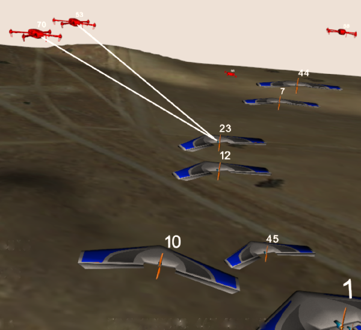

``Fig. 1`` : The SCRIMMAGE multi-agent simulation environment. In this
scenario, blue team fixed-wing agents attack red team quadcopter
defenders. White lines indicate missed shots.

.. _header-n45:

II. PROBLEM FORMULATION
-----------------------

可以将我们的问题表示为不可微分的非凸优化问题：

   We can pose our problem as the non-differentiable, non-convex
   optimization

.. math::

   \theta^*=\arg\max_{\theta\in\Theta}J(\theta)
   \quad\quad\quad\quad (1)

其中
:math:`\Theta\subset\mathbb{R}^n`,是一个作为解空间的非空的紧凑集，而\ :math:`J(\theta)`\ 是一个不可微的非凸实值目标函数\ :math:`J:\Theta\to\mathbb{R}`\ 。
:math:`\theta`
可以是我们问题的\ **决策变量**\的任意组合，包括影响返回结果\ :math:`J`\ 的神经网络权重、PID增益、硬件设计参数等。对于强化学习问题，\ :math:`\theta`
通常表示策略的参数，\ :math:`J`
是将策略顺序应用于环境的\ **隐式函数**\。我们首先回顾如何使用基于梯度的自适应随机搜索方法解决此问题，然后展示ES算法是如何成为这些方法的特例。

   where\ :math:`\Theta\subset\mathbb{R}^n`, a nonempty compact set, is
   the space of solutions, and :math:`J(\theta)` is a
   non-differentiable, non-convex real-valued objective function
   :math:`J:\Theta\to\mathbb{R}`. :math:`\theta` could be any
   combination of ``decision variables`` of our problem, including
   neural network weights, PID gains, hardware design parameters, etc.
   which affect the outcome of the returns :math:`J`. For reinforcement
   learning problems :math:`\theta` usually represents the parameters of
   the policy and :math:`J` is an ``implicit function`` of the
   sequential application of the policy to the environment. We first
   review how this problem can be solved using Gradient-Based Adaptive
   Stochastic Search methods and then show how the ES algorithm is a
   special case of these methods.

.. _header-n53:

*A. Gradient-Based Adaptive Stochastic Search*
~~~~~~~~~~~~~~~~~~~~~~~~~~~~~~~~~~~~~~~~~~~~~~

基于模型的随机搜索方法的目标是通过指定从中采样 [8]_的概率模型（“基于模型”的来由）来将非可微优化问题式(1)转换为可微分问题。让这个模型为\ :math:`p(\theta|\omega)=f(\theta;\omega), \omega\in\varOmega`\ ，其中\ :math:`w`\ 是定义概率分布的参数（例如，对于高斯分布，分布完全由均值和方差\ :math:`\omega=[\mu,\sigma]`\ 参数化。
那么\ :math:`J(\theta)`\ 对分布\ :math:`f(\theta;\omega)`\ 的期望总是小于\ :math:`J`\ 的最优值，即

   The goal of model-based stochastic search methods is to cast the
   non-differentiable optimization problem (1) as a differentiable one
   by specifying a probabilistic model (hence ”model-based”) from which
   to sample  [8]_. Let this model be
   :math:`p(\theta|\omega)= f (\theta;\omega), \omega\in\varOmega`,
   where :math:`w` is a parameter which defines the probability
   distribution (e.g. for Gaussian distributions, the distribution is
   fully parameterized by the mean and variance
   :math:`\omega =[\mu,\sigma]`). Then the expectation of
   :math:`J(\theta)` over the distribution :math:`f (\theta;\omega)`
   will always be less than the optimal value of :math:`J`, i.e.

.. math::

   \int_{\Theta} J(\theta)f(\theta;\omega)d\theta\leq J(\theta^*)
   \quad\quad\quad\quad (2)

基于梯度的自适应随机搜索（GASS）的思想是，可以在分布\ :math:`\varOmega`\ 而不是\ :math:`\varTheta`\ 的参数空间中执行搜索，以获得（2）中最大化期望的分布：

   The idea of Gradient-based Adaptive Stochastic Search (GASS) is that
   one can perform a search in the space of parameters of the
   distribution :math:`\Omega` rather than :math:`\Theta`, for a
   distribution which maximizes the expectation in (2):

.. math::

   \omega^*=\arg\max_{\omega\in\Omega}\int_{\Theta}J(\theta)f(\theta;\omega)d\theta
   \quad\quad\quad\quad (3)

最大化此期望对应于找到最大分布在最佳\ :math:`\theta`\ 周围的分布。然而，与式（1）最大化不同，这个目标函数现在可以相对于\ :math:`\omega`\ 连续且可微分。通过对分布形式的一些假设，相对于\ :math:`\omega`\ 的梯度可以推到期望值之内。

   Maximizing this expectation corresponds to finding a distribution
   which is maximally distributed around the optimal :math:`\theta`.
   However, unlike maximizing (1), this objective function can now be
   made continuous and differentiable with respect to :math:`\omega`.
   With some assumptions on the form of the distribution, the gradient
   with respect to :math:`\omega` can be pushed inside the expectation.

由 [8]_提出的GASS算法适用于\ **概率密度的指数族**\：

   The GASS algorithm presented by  [8]_ is applicable to the
   ``exponential family of probability densities`` :

.. math::

   f(\theta;\omega)=\exp\{\omega^\intercal T(\theta)-\phi(\theta)\}
   \quad\quad\quad\quad (4)

其中\ :math:`\phi(\theta)=ln\int\exp(\omega^\intercal T(\theta)d\theta`
和
:math:`T(\theta)`\ 是足够统计数据的向量。由于我们关注的是显示与使用高斯噪声采样的参数扰动的ES的连接，我们假设\ :math:`f(\theta;\omega)`\ 是高斯的。此外，因为我们关心学习大量参数（即神经网络中的权重），我们假设每个参数都有一个独立的高斯分布。然后，\ :math:`T(\theta)=[\theta,\theta^2]^\intercal\in\mathbb{R}^{2n}`
和\ :math:`\omega=[\mu/\sigma^2,-1/n\sigma^2]^\intercal\in\mathbb{R}^{2n}`\ ，其中\ :math:`\mu`
和\ :math:`\sigma` 分别是对应于每个参数分布的均值和标准差的向量。

   where
   :math:`\phi(\theta)=\ln\int\exp(\omega^\intercal T(\theta))d\theta`,
   and :math:`T(\theta)` is the vector of sufficient statistics. Since
   we are concerned with showing the connection with ES which uses
   parameter perturbations sampled with Gaussian noise, we assume that
   :math:`f(\theta;\omega)` is Gaussian. Furthermore, since we are
   concerned with learning a large number of parameters (i.e. weights in
   a neural network), we assume an independent Gaussian distribution
   over each parameter. Then,
   :math:`T(\theta)=[\theta,\theta^2]^\intercal\in\mathbb{R}^{2n}` and
   :math:`\omega=[\mu/\sigma^2,-1/n\sigma^2]^\intercal\in\mathbb{R}^{2n}`,
   where :math:`\mu` and :math:`\sigma` are vectors of the mean and
   standard deviation corresponding to the distribution of each
   parameter, respectively.

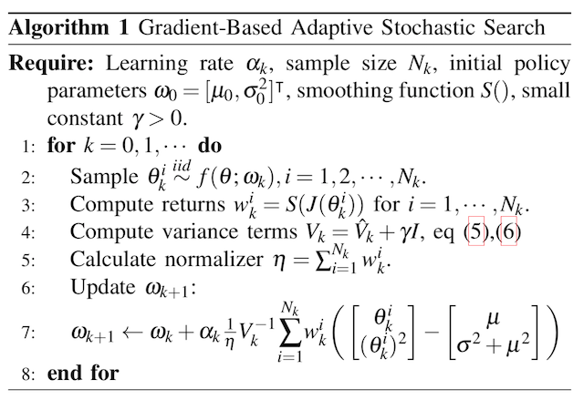

我们为这组特定的概率模型提出了GASS算法（算法1），尽管收敛分析适用于更一般的指数分布族。对于每次迭代\ :math:`k`\ ，GASS算法涉及绘制\ :math:`N_k`\ 参数样本\ :math:`\theta_k^i\stackrel{iid}{\sim}f(\theta;\omega_k),i=1,2,\cdots,N_k`\ 。
然后使用这些参数对返回函数\ :math:`J(\theta_k^i)`\ 进行采样。
通过整形函数\ :math:`S(\cdot):\mathbb{R}\rightarrow\mathbb{R}^+`\ 给出返回值，然后用于计算模型参数\ :math:`\omega_{k+1}`\ 的更新。

   We present the GASS algorithm for this specific set of probability
   models (Algorithm 1), although the analysis for convergence holds for
   the more general exponential family of distributions. For each
   iteration :math:`k`, The GASS algorithm involves drawing :math:`N_k`
   samples of parameters
   :math:`\theta_k^i\stackrel{iid}{\sim}f(\theta;\omega_k),i=1,2,\cdots,N_k`.
   These parameters are then used to sample the return function
   :math:`J(\theta_k^i)`. The returns are fed through a shaping function
   :math:`S(\cdot):\mathbb{R}\rightarrow\mathbb{R}^+` and then used to
   calculate an update on the model parameters :math:`\omega_{k+1}`.

对于有界输入，\ **整形函数**\ \ :math:`S(\cdot)`\ 必须是非减少和从上到下的界限，其下限远离0。此外，集合\ :math:`\{\arg\max_{\theta\in\Theta}S(J(\theta))\}`\ 必须是原始问题\ :math:`\{\arg\max_{\theta\in\Theta}J(\theta)\}`\ 的解集的非空子集。
整形函数可用于调整\ **探索/充分利用信息**\之间的权衡，或在采样时帮助处理异常值。
GASS的原始分析假定\ :math:`S_k{(\cdot)}`\ 的更一般形式，其中\ :math:`S`\ 可以在每次迭代时改变。为简单起见，我们假设它在每次迭代时都是确定性的和不变的。

   The ``shaping function`` :math:`S(\cdot)` is required to be
   nondecreasing and bounded from above and below for bounded inputs,
   with the lower bound away from 0. Additionally, the set
   :math:`\{\arg\max_{\theta\in\Theta}S(J(\theta))\}` must be a nonempty
   subset of the set of solutions of the original problem
   :math:`\{\arg\max_{\theta\in\Theta}J(\theta)\}`. The shaping function
   can be used to adjust the ``exploration/exploitation`` trade-off or
   help deal with outliers when sampling. The original analysis of GASS
   assumes a more general form of :math:`S_k(\cdot)` where :math:`S` can
   change at each iteration. For simplicity we assume here it is
   deterministic and unchanging per iteration.

.. code::

   注：
   一个Agent必须在exploitation(充分利用信息)以最大化回报（反映在其当前的效用估计上）
   和exploration(探索)以最大化长期利益之间进行折中。
   ----《人工智能：一种现代方法（第三版）》，清华大学出版社，P.696

GASS可以被认为是二阶梯度法，需要估计采样参数的方差：

   GASS can be considered a second-order gradient method and requires
   estimating the variance of the sampled parameters:

.. math::

   \hat{V}_k=\frac{1}{N_k-1}\sum_{i=1}^{N_k}T(\theta_k^i)T(\theta_k^i)^\intercal
   -\frac{1}{N_k^2-N_k}\Bigg(\sum_{i=1}^{N_k}T(\theta_k^i)\Bigg)\Bigg(\sum_{i=1}^{N_k}T(\theta_k^i)\Bigg)^\intercal.
   \quad\quad\quad\quad (5)

实际上，如果参数空间\ :math:`\Theta`\ 的大小很大，就像神经网络中的情况一样，这个方差矩阵的大小为
:math:`2\times 2n`\ ，计算成本很高。
在我们的工作中，我们通过独立计算每个独立高斯参数的方差来近似\ :math:`\hat{V}_k`\ 。
稍微滥用符号，请将\ :math:`\tilde{\theta}^i_k`\ 视为\ :math:`\theta^i_k`\ 的标量元素。
然后我们为每个标量元素\ :math:`\tilde{\theta}^i_k` 一个
:math:`2\times 2` 方差矩阵：

   In practice if the size of the parameter space :math:`\Theta` is
   large, as is the case in neural networks, this variance matrix will
   be of size :math:`2n\times 2n` and will be costly to compute. In our
   work we approximate :math:`\hat{V}_k` with independent calculations
   of the variance on the parameters of each independent Gaussian. With
   a slight abuse of notation, consider :math:`\tilde{\theta}_k^i` as a
   scalar element of :math:`\theta_k^i`. We then have, for each scalar
   element :math:`\tilde{\theta}_k^i` a :math:`2\times 2` variance
   matrix:

.. math::

   \hat{V}_k=\frac{1}{N_k-1}\sum_{i=1}^{N_k}\begin{bmatrix} \tilde{\theta}_k^i\\(\tilde{\theta}_k^i)^2\end{bmatrix}\begin{bmatrix} \tilde{\theta}_k^i&(\tilde{\theta}_k^i)^2\end{bmatrix}
   -\frac{1}{N_k^2-N_k}\Bigg(\sum_{i=1}^{N_k}\begin{bmatrix} \tilde{\theta}_k^i\\(\tilde{\theta}_k^i)^2\end{bmatrix}\Bigg)\Bigg(\sum_{i=1}^{N_k}\begin{bmatrix} \tilde{\theta}_k^i&(\tilde{\theta}_k^i)^2\end{bmatrix}\Bigg).
   \quad\quad\quad\quad (6)

定理1表明GASS产生一个\ :math:`\omega_k`\ 序列，它收敛到一个极限集，它指定一组最大化的分布（式（3））。
此集合中的分布将指定如何选择
:math:`\theta^\ast`\ 以最终最大化（式（1））。
与大多数非凸优化算法一样，我们不能保证达到全局最大值，但使用概率模型和仔细选择整形函数应该有助于避免早期收敛到次优的局部最大值。证明依赖于以广义Robbins-Monro算法的形式投射更新规则（参见 [8]_，定理1和2）。定理1还根据迭代次数\ :math:`k`\ ，每次迭代的样本数\ :math:`N_k`\ 以及学习率\ :math:`\alpha_k`\ 指定收敛速度。在实践中，定理1意味着需要仔细平衡每次迭代的样本数量的增加以及随着迭代的进展而降低学习率。

   Theorem 1 shows that GASS produces a sequence of :math:`\omega_k`
   that converges to a limit set which specifies a set of distributions
   that maximize (3). Distributions in this set will specify how to
   choose :math:`\theta^\ast` to ultimately maximize (1). As with most
   non-convex optimization algorithms, we are not guaranteed to arrive
   at the global maximum, but using probabilistic models and careful
   choice of the shaping function should help avoid early convergence
   into suboptimal local maximum. The proof relies on casting the update
   rule in the form of a generalized Robbins-Monro algorithm (see [8]_, Thms 1 and 2). Theorem 1 also specifies convergence rates in
   terms of the number of iterations :math:`k`, the number of samples
   per iteration :math:`N_k`, and the learning rate :math:`\alpha_k`. In
   practice Theorem 1 implies the need to carefully balance the increase
   in the number of samples per iteration and the decrease in learning
   rate as iterations progress.

:math:`{Assumption 1}`

*i) The learning rate* :math:`\alpha_k>0, \alpha_k\rightarrow 0` *as* :math:`k\rightarrow\infty`, *and* :math:`\sum_{k=0}^\infty \alpha_k=\infty`.

*ii) The sample size* :math:`N_k=N_0k^\xi`, where :math:`\xi>0`; *also* :math:`\alpha_k` *and* :math:`N_k` *jointly satisfy* :math:`\alpha/\sqrt{N_k}=\mathcal{O}(k^{-\beta})`.

*iii)*  :math:`T(\theta)` *is bounded on* :math:`\Theta`

*iv) If* :math:`\omega^*` *is a local maximum of (3), the Hessian of*  :math:`\int_{\Theta}J(\theta)f(\theta;\omega)d\theta` *is continuous and symmetric negative definite in a neighborhood of* :math:`\omega^*`.

:math:`{Theorem 1}`

*Assume that Assumption 1 holds.  Let* :math:`\alpha_k=\alpha_0/k^\alpha` *for* :math:`0<\alpha<1`.  *Let* :math:`N_k=N_0k^{\tau-\alpha}` *where* :math:`\tau> 2\alpha` *is a constant. Then the sequence* :math:`\{\omega_k\}` *generated by Algorithm 1 converges to a limit set w.p.1. with rate* :math:`\mathcal{O}(1/\sqrt{k^\tau})`.

.. _header-n107:

*B. 进化策略(Evolutionary Strategies)*
~~~~~~~~~~~~~~~~~~~~~~~~~~~~

我们现在回顾一下 [4]_ 提出的ES算法，并展示它是如何是GASS算法的一阶近似。
ES算法由与GASS相同的两个阶段组成：1）随机扰动具有从高斯分布采样的噪声的参数。
2）计算回报并计算参数的更新。
算法2中概述了该算法。一旦计算出返回值，它们就通过函数\ :math:`S(\cdot)`\ 发送，该函数执行适应性整形 [17]_。
Salimans等人使用\ :math:`S(\cdot)`\ 的等级变换函数，他们认为减少了每次迭代中异常值的影响，并有助于避免局部最优。

   We now review the ES algorithm proposed by  [4]_ and show how it is
   a first-order approximation of the GASS algorithm. The ES algorithm
   consists of the same two phases as GASS: 1) Randomly perturb
   parameters with noise sampled from a Gaussian distribution. 2)
   Calculate returns and calculate an update to the parameters. The
   algorithm is outlined in Algorithm 2. Once returns are calculated,
   they are sent through a function :math:`S(\cdot)` which performs
   fitness shaping  [17]_. Salimans et al. used a rank transformation
   function for :math:`S(\cdot)` which they argue reduced the influence
   of outliers at each iteration and helped to avoid local optima.

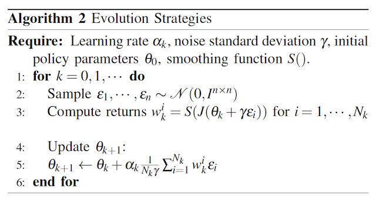

很明显，当采样分布是点分布时，ES算法是GASS算法的子情况。
我们还可以通过忽略算法1中第\ :math:`7`\ 行的方差项来恢复ES算法。代替归一化项\ :math:`\eta`\ ，ES使用样本数\ :math:`N_k`\ 。

   It is clear that the ES algorithm is a sub-case of the GASS algorithm
   when the sampling distribution is a point distribution. We can also
   recover the ES algorithm by ignoring the variance terms on line
   :math:`7` in Algorithm 1. Instead of the normalizing term
   :math:`\eta`, ES uses the number of samples :math:`N_k`.

GASS
:math:`\gamma`\ 中的小常量成为ES算法中的方差项。算法2中的更新规则涉及将缩放的返回值乘以噪声，这在算法1中正好是\ :math:`\theta_k^i-\mu`\ 。

   The small constant in GASS :math:`\gamma` becomes the variance term
   in the ES algorithm. The update rule in Algorithm 2 involves
   multiplying the scaled returns by the noise, which is exactly
   :math:`\theta_k^i-\mu` in Algorithm 1.

我们看到ES具有与GASS分析相同的渐近收敛速度。
虽然GASS是一种二阶方法，而ES只是一阶方法，但在实践中，ES使用近似的二阶梯度下降方法来调整学习速率，以加速和稳定学习。

   We see that ES enjoys the same asymptotic convergence rates offered
   by the analysis of GASS. While GASS is a second-order method and ES
   is only a first-order method, in practice ES uses approximate
   second-order gradient descent methods which adapt the learning rate
   in order to speed up and stabilize learning.

这些方法的示例包括ADAM，RMSProp，具有动量的SGD等，其已经显示出对神经网络非常好地执行。
因此，我们可以将ES视为GASS使用的完整二阶方差更新的一阶近似。
在我们的实验中，我们使用ADAM  [18]_来调整每个参数的学习率。
正如在 [4]_中类似地报道的那样，当使用自适应学习率时，我们发现在调整采样分布的方差方面几乎没有改进。
我们假设具有自适应学习速率的一阶方法足以在优化神经网络时实现良好的性能。
然而，对于其他类型的策略参数化，GASS的完整二阶处理可能更有用。
还可以混合和匹配哪些参数需要完全方差更新，并且可以使用一阶近似方法更新。
我们使用\ :math:`S(\cdot)`\ 的等级转换函数并保持 :math:`N_k`\ 不变。

   Examples of these methods include ADAM, RMSProp, SGD with momentum,
   etc., which have been shown to perform very well for neural networks.
   Therefore we can treat ES a first-order approximation of the full
   second-order variance updates which GASS uses. In our experiments we
   use ADAM  [18]_ to adapt the learning rate for each parameter. As
   similarly reported in  [4]_, when using adaptive learning rates we
   found little improvement over adapting the variance of the sampling
   distribution. We hypothesize that a first order method with adaptive
   learning rates is sufficient for achieving good performance when
   optimizing neural networks. For other types of policy
   parameterizations however, the full second-order treatment of GASS
   may be more useful. It is also possible to mix and match which
   parameters require a full variance update and which can be updated
   with a first-order approximate method. We use the rank transformation
   function for :math:`S(\cdot)` and keep :math:`N_k` constant.

.. _header-n126:

*C. 多Agent问题的结构化策略学习(Learning Structured Policies for Multi-Agent Problems)*
~~~~~~~~~~~~~~~~~~~~~~~~~~~~~~~~~~~~~~~~~~~~~~~~~~~~~~~~~~

现在我们对ES/GASS方法的融合更有信心，我们展示了如何在大规模多代理环境中使用ES来优化复杂的策略。我们使用SCRIMMAGE多代理仿真环境 [16]_，因为它允许我们快速并行地模拟复杂的多代理方案。我们使用6DoF固定翼飞机和四旋翼飞行器进行模拟，动力学模型分别具有10和12个状态。这些动力学模型允许在实际操作状态下进行全范围的运动。风和控制噪声形式的随机扰动被建模为\ **加性高斯噪声**\。可能发生地面和空中的碰撞，从而导致飞机被摧毁。我们还采用了一个武器模块，可以在从飞机机头突出的固定锥体内射击敌人。击中的概率取决于到目标的距离以及目标朝向攻击者的投影总面积。该区域基于飞机的\ **线框模型**\及其相对姿态。有关更多详细信息，请参阅我们的代码和SCRIMMAGE模拟器文档。

   Now that we are more confident about the convergence of the ES/GASS
   method, we show how ES can be used to optimize a complex policy in a
   large-scale multi-agent environment. We use the SCRIMMAGE multi-agent
   simulation environment  [16]_ as it allows us to quickly and in
   parallel simulate complex multi-agent scenarios. We populate our
   simulation with 6DoF fixed-wing aircraft and quadcopters with
   dynamics models having 10 and 12 states, respectively. These dynamcis
   models allow for full ranges of motion within realistic operating
   regimes. Stochastic disturbances in the form of wind and control
   noise are modeled as \ **additive Gaussian noise**\. Ground and mid-air
   collisions can occur which result in the aircraft being destroyed. We
   also incorporate a weapons module which allows for targeting and
   firing at an enemy within a fixed cone projecting from the aircraft's
   nose. The probability of a hit depends on the distance to the target
   and the total area presented by the target to the attacker. This area
   is based on the \ **wireframe model**\ of the aircraft and its relative
   pose. For more details, see our code and the SCRIMMAGE simulator
   documentation.

我们考虑每个代理使用自己的策略来计算自己的控制的情况，但是所有代理的策略参数都相同。这允许每个代理以无中心的方式控制自己，同时允许出现对群体有益的行为。
此外，我们假设作为友机的代理可以进行通信以彼此共享状态（参见图2）。
由于我们拥有大量代理（每个团队最多\ :math:`50`\ 个），为了降低通信成本，我们只允许代理在局部共享信息，即彼此靠近的代理可以访问彼此的状态。
在我们的实验中，我们允许每个代理感知最近的\ :math:`5`\ 个友方代理的状态，总共传入\ :math:`5*10=50`\ 状态消息。

   We consider the case where each agent uses its own policy to compute
   its own controls, but where the parameters of the policies are the
   same for all agents. This allows each agent to control itself in a
   decentralized manner, while allowing for beneficial group behaviors
   to emerge. Furthermore, we assume that friendly agents can
   communicate to share states with each other (see Figure 2). Because
   we have a large number of agents (up to 50 per team), to keep
   communication costs lower we only allow agents to share information
   locally, i.e. agents close to each other have access to each other's
   states. In our experiments we allow each agent to sense the states of
   the closest 5 friendly agents for a total of :math:`5*10=50` incoming
   state messages.

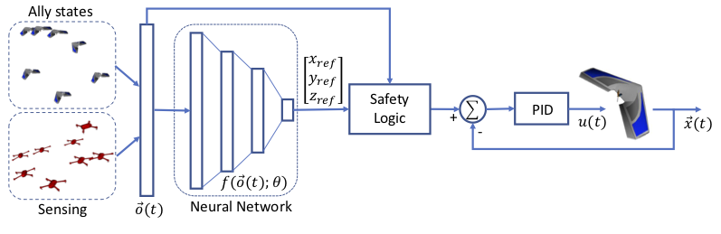

``图 2``: 每个代理的策略示意图。附近的友机状态和感知到的敌机，基地位置等，以及代理自己的状态被馈送到神经网络中，该网络以相对xyz坐标系产生参考目标。
目标被送入安全逻辑模块，该模块检查与邻机或地面是否碰撞。最终产生出一个参考目标，该目标被馈送到PID控制器，PID控制器又为代理（推力，副翼，升降舵，方向舵）提供级别控制。

   ``Fig. 2``: Diagram of each agent’s policy. Nearby ally states and
   sensed enemies, base locations, etc. along with the agent’s own state
   are fed into a neural network which produces a reference target in
   relative xyz coordinates. The target is fed into the safety logic
   block which checks for collisions with neighbors or the ground. It
   produces a reference target which is fed to the PID controller, which
   in turn provides low-level controls for the agent (thrust, aileron,
   elevator, rudder).

此外，每个代理都配备了传感器来检测敌方代理。这里没有全状态可观测性，相反我们假设传感器能够感知敌人的相对位置和速度。在我们的实验中，我们假设每个探测器能够感知最近的5个敌人，总共\ :math:`5*7=35`\ 敌人数据维度（\ :math:`7`\ 个状态\ :math:`=`\ [相对xyz位置，距离和相对xyz速度]）。传感器还提供有关乙方和敌方基地相对指向和距离（另外\ :math:`8`\ 个状态）的信息。通过添加代理自己的状态（\ :math:`9`\ 个状态），策略的观察输入\ :math:`\vec{o}(t)`\ 的维度为\ :math:`102`\ 。这些输入状态被馈送到代理的策略中：具有3个完全连接的层神经网络\ :math:`f(\vec{o}(t);\theta)`\ ，规模分别为200,200和50，输出3个值表示\ **期望的**\相对航向\ :math:`[x_{ref},y_{ref},z_{ref}]`\ 。每个代理的神经网络都有超过70,000个参数。每个代理使用与其队友相同的神经网络参数，但由于每个代理在每个时间步都遇到不同的观察，因此每个代理的神经网络策略的输出将是唯一的。也可以为每个代理学习独自的策略，我们将此留待为将来的工作。

   Additionally, each agent is equipped with sensors to detect enemy
   agents. Full state observability is not available here, instead we
   assume that sensors are capable of sensing an enemy's relative
   position and velocity. In our experiments we assumed that each agent
   is able to sense the nearest 5 enemies for a total of :math:`5*7=35`
   dimensions of enemy data (:math:`7` states = [relative xyz position,
   distance, and relative xyz velocities]). The sensors also provide
   information about home and enemy base relative headings and distances
   (an additional :math:`8` states). With the addition of the agent's
   own state (:math:`9` states), the policy's observation input
   :math:`\vec{o}(t)` has a dimension of :math:`102`. These input states
   are fed into the agent's policy: a neural network
   :math:`f(\vec{o}(t);\theta)` with 3 fully connected layers with sizes
   200, 200, and 50, which outputs 3 numbers representing a
   ``desired relative heading`` :math:`[x_{ref},y_{ref},z_{ref}]`. Each
   agent's neural network has more than 70,000 parameters. Each agent
   uses the same neural network parameters as its teammates, but since
   each agent encounters a different observation at each timestep, the
   output of each agent's neural network policy will be unique. It may
   also be possible to learn unique policies for each agent; we leave
   this for future work.

由于安全是无人机飞行中的一个大问题，我们设计的策略考虑了安全和控制因素。神经网络策略的相对航向输出旨在由PID控制器用于跟踪航向。
PID控制器向飞机（推力，副翼，升降舵，方向舵）提供低级别控制指令\ :math:`u(t)`\ 。然而，为了防止神经网络策略引导飞机撞击地面或盟友等的情况，如果飞机即将与某物碰撞，我们会以避让方向超越神经网络。这有助于将学习过程集中在如何与环境和盟友进行智能交互，而不是学习如何避免明显的错误。
此外，通过以结构化和可解释的方式设计策略，将学习的策略直接从模拟环境中带入现实世界将更容易。由于策略的神经网络组件不产生低级指令，因此它对于不同的低级控制器、动力学、PID增益等是不变的。这有助于为实际应用学习更多可转换的策略。

   With safety being a large concern in UAV flight, we design the policy
   to take into account safety and control considerations. The relative
   heading output from the neural network policy is intended to be used
   by a PID controller to track the heading. The PID controller provides
   low-level control commands :math:`u(t)` to the aircraft (thrust,
   aileron, elevator, rudder). However, to prevent cases where the
   neural network policy guides the aircraft into crashing into the
   ground or allies, etc., we override the neural network heading with
   an avoidance heading if the aircraft is about to collide with
   something. This helps to focus the learning process on how to intelligently interact with the environment and allies rather than learning how to avoid obvious mistakes.
   Furthermore, by designing the policy in a structured and
   interpretable way, it will be easier to take the learned policy
   directly from simulation into the real world. Since the neural
   network component of the policy does not produce low-level commands,
   it is invariant to different low-level controllers, dynamics, PID
   gains, etc. This aids in learning more transferrable policies for
   real-world applications.

.. _header-n145:

III. Experiments
----------------

我们考虑两种场景：一种是基地攻击场景，其中一支由50架固定翼飞机组成的团队必须攻击由20个四旋翼无人机防守的敌方基地；以及一个团队对抗任务，上述两个团队同时学习击败对方。在这两项任务中，我们使用以下奖励：

   We consider two scenarios: a base attack scenario where a team of 50
   fixed wing aircraft must attack an enemy base defended by 20
   quadcopters, and a team competitive task where two teams concurrently
   learn to defeat each other. In both tasks we use the following reward

.. math::

   J=10\times (\text{\#kills}) + 50\times(\text{\#collisions with enemy base})
     - 1e-5\times(\text{distance from enemy base at end of episode})
   \quad\quad\quad\quad (7)

奖励函数鼓励空对空作战，以及对敌基地的自杀式袭击（例如一群携带有效载荷的廉价一次性无人机）。
最后一部分是鼓励飞机在学习的初始阶段向敌人基地方向移动。

   The reward function encourages air-to-air combat, as well as suicide
   attacks against the enemy base (e.g. a swarm of cheap, disposable
   drones carrying payloads). The last term encourages the aircraft to
   move towards the enemy during the initial phases of learning.

.. _header-n153:

A. 基地攻击任务(Base Attack Task)
~~~~~~~~~~~~~~~~~~~

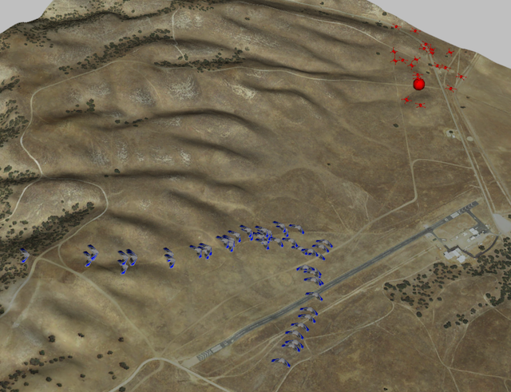

``图 3`` ：基本攻击任务的快照。
蓝色固定翼组（左下方）的目标是攻击红色基地（红点，右上方），同时避开或攻击红色旋翼飞行器的防守。

   ``Fig. 3``: Snapshot of base attack task. The goal of the blue fixed
   wing team (lower left) is to attack the red base (red dot, upper
   right) while avoiding or attacking red quadcopter guards.

在这种场景下，由50架固定翼飞机组成的团队必须攻击由20个四旋翼飞行器防守的敌方基地（图3）。
四旋翼飞行器使用手工制定的策略，在没有敌机的情况下，它们均匀地展开而覆盖基地。
面临敌机时，他们瞄准最近的敌机，匹配敌人的高度，并反复射击。
我们使用\ :math:`N_k=300, \gamma=0.02`\ ，\ :math:`0.1`\ 秒的时间步长，以及\ :math:`200`\ 秒的时长。
两队的初始位置随机分布在竞技场对面两端的固定区域。 在配备Xeon Phi
CPU（244线程）的计算机上进行两天完全并行化的训练。

   In this scenario a team of 50 fixed-wing aircraft must attack an
   enemy base defended by 20 quadcopters (Figure 3). The quadcopters use
   a hand-crafted policy where in the absence of an enemy, they spread
   themselves out evenly to cover the base. In the presence of an enemy
   they target the closest enemy, match that enemy's altitude, and fire
   repeatedly. We used :math:`N_k=300, \gamma=0.02`, a time step of
   :math:`0.1` seconds, and total episode length of :math:`200` seconds.
   Initial positions of both teams were randomized in a fixed area at
   opposide ends of the arena. Training took two days with full
   parallelization on a machine equipped with a Xeon Phi CPU (244
   threads).

我们发现，在整个训练过程中，固定翼团队学会了一种策略，在这种策略下，他们很快形成了一个V字阵型并接近基地。
一些飞机自杀式袭击敌人基地，而其他飞机则开始和敌机\ **火拼**\（见补充视频 https://goo.gl/dWvQi7 ）。
我们还将ES方法的实现与众所周知的交叉熵方法（CEM）进行了比较。
CEM的表现明显差于ES（图4）。
我们假设这是因为CEM抛出了很大一部分采样参数，因此获得了式（3）梯度的更差估计。
与其他完整的二阶方法（例如CMA-ES或完整的二阶GASS算法）的比较是不现实的，这是由于神经网络中的大量参数以及计算这些参数的协方差的过高的令人望而却步的计算难度。

   We found that over the course of training the fixed-wing team learned
   a policy where they quickly form a V-formation and approach the base.
   Some aircraft suicide-attack the enemy base while others begin *dog-fighting* (see supplementary video https://goo.gl/dWvQi7). We
   also compared our implementation of the ES method against the
   well-known cross-entropy method (CEM). CEM performs significantly
   worse than ES (Figure 4). We hypothesize this is because CEM throws
   out a significant fraction of sampled parameters and therefore
   obtains a worse estimate of the gradient of (3). Comparison against
   other full second-order methods such as CMA-ES or the full
   second-order GASS algorithm is unrealistic due to the large number of
   parameters in the neural network and the prohibitive computational
   difficulties with computing the covariances of those parameters.

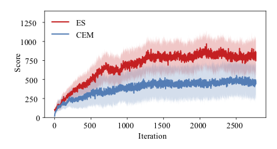

``(a) Training``

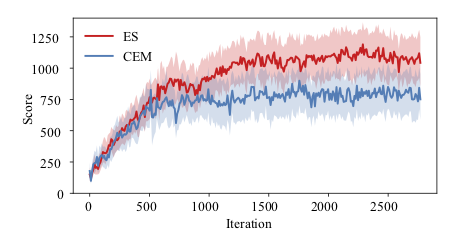

``(b) Testing``

.. _header-n171:

B. 两队对抗(Two Team Competitive Match)
~~~~~~~~~~~~~~~~~~~~~~~~~~~~~

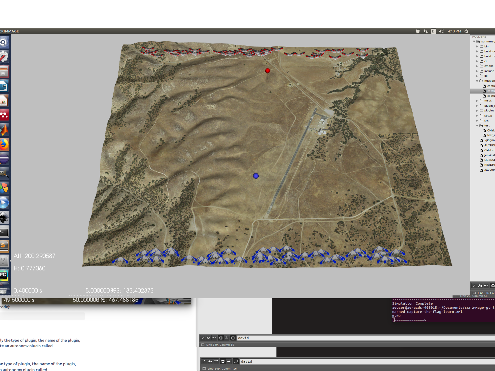

``(a) 初始状态``

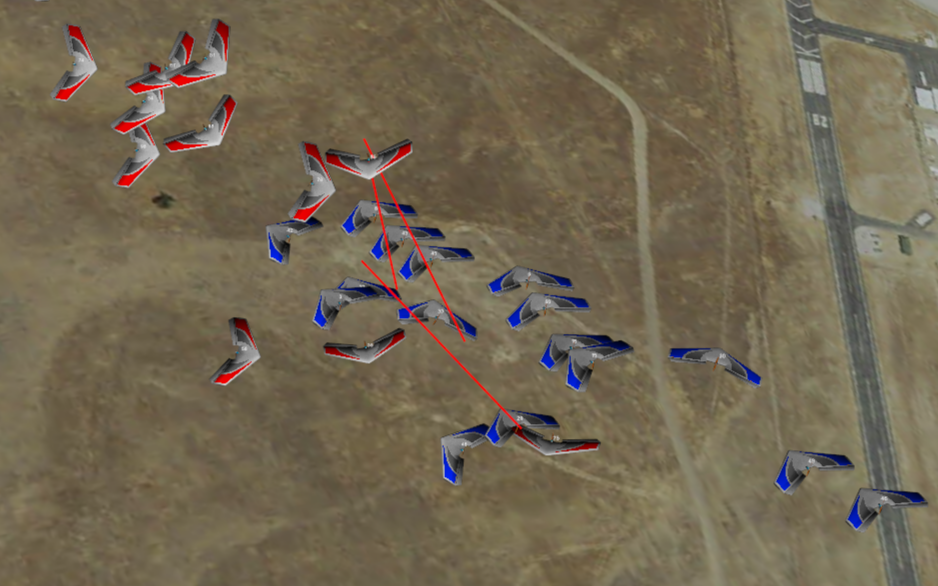

``(b) 对抗过程截图``

我们考虑的第二种场景是两个团队各自为他们的代理配备他们自己的独特策略，同时学习打败他们的对手（图5）。在每次迭代中，产生\ :math:`N_k=300`\ 仿真，每此仿真具有不同的随机扰动，并且每个团队具有不同的扰动。每个策略的更新是根据从玩对手的扰动策略中获得的分数计算的。结果是每个团队都学会在每次迭代中击败各种各样的对手行为。我们观察到两队的行为很快接近纳什均衡，双方试图击败最大数量的对手飞机以防止更高得分的自杀式攻击（见补充视频）。最终的结果是两支球队相互消灭的僵局，以并列得分结束（图6）。我们假设通过让每个团队与一些过去的敌人团队行为竞争或通过构建可供选择的策略库来学习更多样化的行为，正如进化计算社区经常讨论的那样[19]_。

   The second scenario we consider is where two teams each equipped with
   their own unique policies for their agents learn concurrently to
   defeat their opponent (Figure 5). At each iteration, :math:`N_k=300`
   simulations are spawned, each with a different random perturbation,
   and with each team having a different perturbation. The updates for
   each policy are calculated based on the scores received from playing
   the opponent's perturbed policies. The result is that each team
   learns to defeat a wide range of opponent behaviors at each
   iteration. We observed that the behavior of the two teams quickly
   approached a Nash equilibrium where both sides try to defeat the
   maximum number of opponent aircraft in order to prevent
   higher-scoring suicide attacks (see supplementary video). The end
   result is a stalemate with both teams annihilating each other, ending
   with tied scores (Figure 6). We hypothesize that more varied behavior
   could be learned by having each team compete against some past enemy
   team behaviors or by building a library of policies from which to
   select from, as frequently discussed by the evolutionary computation
   community [47]_.

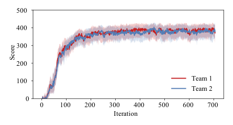

``(a) Training``

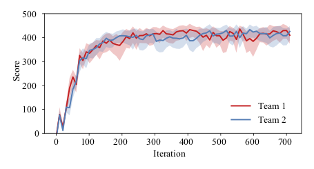

``(b) Testing``

.. _header-n184:

IV. CONCLUSION
--------------

我们的研究已经表明，在竞争和合作多智能体的背景下，进化策略适用于学习那些用于各种复杂任务的具有数千个参数的策略。通过展示ES与更易于理解的基于模型的随机搜索方法之间的联系，我们能够深入了解未来的算法设计。未来的工作将包括优化混合参数化的实验，例如：优化神经网络权重和PID增益。在这种情况下，对非神经网络参数的二阶处理可能更有益，因为系统的行为可能对非神经网络参数的扰动更敏感。另一个研究方向将会是为团队中的每个代理优化独特的策略。再一个方向就是比较用于训练神经网络的其他进化计算策略，包括使用更多样化群体的方法 [20]_，或更多j具有启发类型的遗传算法 [21]_。

   We have shown that Evolution Strategies are applicable for learning
   policies with many thousands of parameters for a wide range of
   complex tasks in both the competitive and cooperative multi-agent
   setting. By showing the connection between ES and more
   well-understood model-based stochastic search methods, we are able to
   gain insight into future algorithm design. Future work will include
   experiments with optimizing mixed parameterizations, e.g. optimizing
   both neural network weights and PID gains. In this case, the
   second-order treatment on non-neural network parameters may be more
   beneficial, since the behavior of the system may be more sensitive to
   perturbations of non-neural network parameters. Another direction of
   investigation could be optimizing unique policies for each agent in
   the team. Yet another direction would be comparing other evolutionary
   computation strategies for training neural networks, including
   methods which use a more diverse population [20]_, or more genetic
   algorithm-type heuristics [21]_.

.. _header-n190:

REFERENCES
----------

https://link.springer.com/10.1007/s10458-005-2631-2

https://calhoun.nps.edu/handle/10945/34665

J. Schmidhuber, “Natural evolution strategies.” Journal of Machine
Learning Research, vol. 15, no. 1, pp. 949–980, 2014.

J. Clune, “Deep Neuroevolution: Genetic Algorithms Are a Competitive
Alternative for Training Deep Neural Networks for Reinforcement
Learning,” ArXiv e-prints, Dec. 2017.

.. [1]
   Y. Li, “Deep Reinforcement Learning: An Overview,” ArXiv e-prints,
   Jan. 2017.

.. [2]
   K. Stanley and B. Bryant, “Real-time neuroevolution in the NERO video
   game,” IEEE transactions on, 2005. [Online]. Available:
   https://ieeexplore.ieee.org/document/1545941

.. [3]
   O. J. Coleman, “Evolving Neural Networks for Visual Processing,”
   Thesis, 2010.

.. [4]
   Y. Li, “Deep Reinforcement Learning: An Overview,” ArXiv e-prints,
   Jan. 2017.

.. [5]
   K. Stanley and B. Bryant, “Real-time neuroevolution in the NERO video
   game,” IEEE transactions on, 2005. [Online]. Available:
   https://ieeexplore.ieee.org/document/1545941

.. [6]
   O. J. Coleman, “Evolving Neural Networks for Visual Processing,”
   Thesis, 2010.

.. [7]
   zT. Salimans, J. Ho, X. Chen, S. Sidor, and I. Sutskever, “Evolution
   Strategies as a Scalable Alternative to Reinforcement Learning,”
   ArXiv e-prints, Mar. 2017.

.. [8]
   zT. Salimans, J. Ho, X. Chen, S. Sidor, and I. Sutskever, “Evolution
   Strategies as a Scalable Alternative to Reinforcement Learning,”
   ArXiv e-prints, Mar. 2017.

.. [9]
   zT. Salimans, J. Ho, X. Chen, S. Sidor, and I. Sutskever, “Evolution
   Strategies as a Scalable Alternative to Reinforcement Learning,”
   ArXiv e-prints, Mar. 2017.

.. [10]
   J. Hu, “Model-based stochastic search methods,” in Handbook of
   Simulation Optimization. Springer, 2015, pp. 319–340.

.. [11]
   S. Mannor, R. Rubinstein, and Y. Gat, “The cross entropy method for
   fast policy search,” in Machine Learning-International Workshop Then
   Conference-, vol. 20, no. 2, 2003, Conference Proceedings, p. 512.

.. [12]
   N. Hansen, “The CMA evolution strategy: A tutorial,” CoRR, vol.
   abs/1604.00772, 2016. [Online]. Available: http://arxiv.org/abs/1604.
   00772

.. [13]
   E. Zhou and J. Hu, “Gradient-based adaptive stochastic search for
   non-differentiable optimization,” IEEE Transactions on Automatic
   Control, vol. 59, no. 7, pp. 1818–1832, 2014.

.. [14]
   zT. Salimans, J. Ho, X. Chen, S. Sidor, and I. Sutskever, “Evolution
   Strategies as a Scalable Alternative to Reinforcement Learning,”
   ArXiv e-prints, Mar. 2017.

.. [15]
   J. Hu, “Model-based stochastic search methods,” in Handbook of
   Simulation Optimization. Springer, 2015, pp. 319–340.

.. [16]
   S. Mannor, R. Rubinstein, and Y. Gat, “The cross entropy method for
   fast policy search,” in Machine Learning-International Workshop Then
   Conference-, vol. 20, no. 2, 2003, Conference Proceedings, p. 512.

.. [17]
   N. Hansen, “The CMA evolution strategy: A tutorial,” CoRR, vol.
   abs/1604.00772, 2016. [Online]. Available: http://arxiv.org/abs/1604.
   00772

.. [18]
   E. Zhou and J. Hu, “Gradient-based adaptive stochastic search for
   non-differentiable optimization,” IEEE Transactions on Automatic
   Control, vol. 59, no. 7, pp. 1818–1832, 2014.

.. [19]
   L. Panait and S. Luke, “Cooperative multi-agent learning: The state
   of the art,” Autonomous Agents and Multi-Agent Systems, vol.z11, no.
   3, pp. 387–434, 2005. [Online]. Available: http:

.. [20]
   J. B. Rawlings and B. T. Stewart, “Coordinating multiple
   optimization-based controllers: New opportunities and challenges,”
   Journal of Process Control, vol. 18, no. 9, pp. 839–845, 2008.

.. [21]
   W. Al-Gherwi, H. Budman, and A. Elkamel, “Robust distributed model
   predictive control: A review and recent developments,” The Canadian
   Journal of Chemical Engineering, vol. 89, no. 5, pp. 1176–1190, 2011.
   [Online]. Available: http://doi.wiley.com/10.1002/cjce.20555
