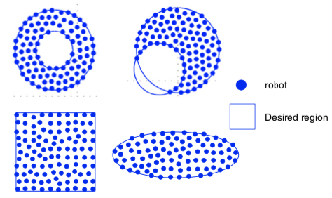
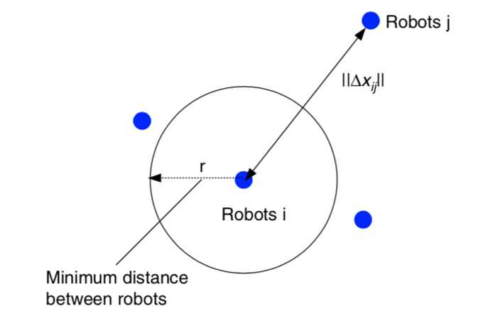
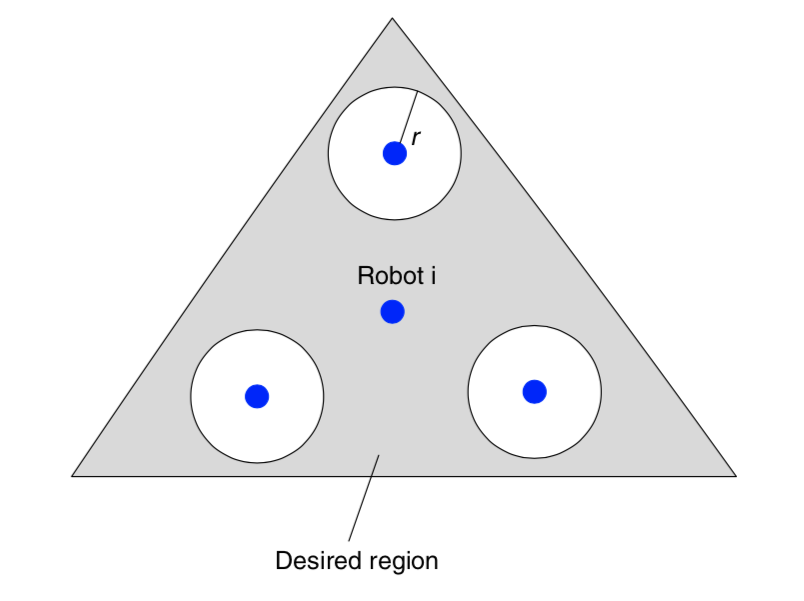
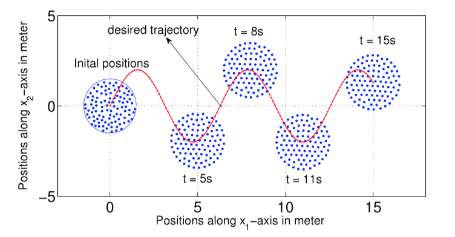
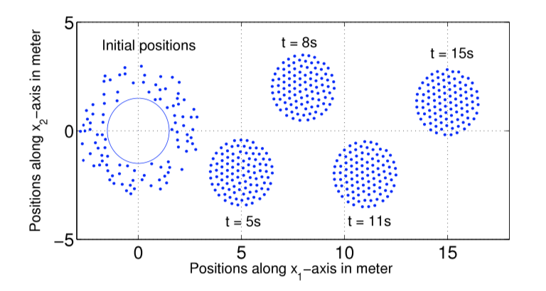
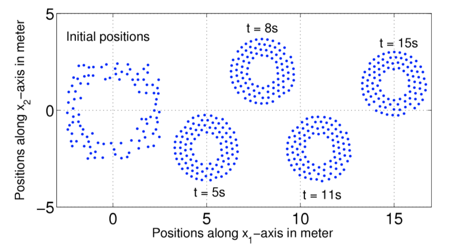
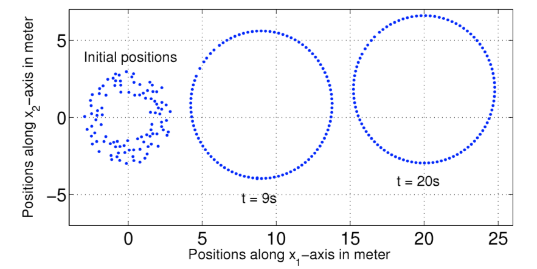
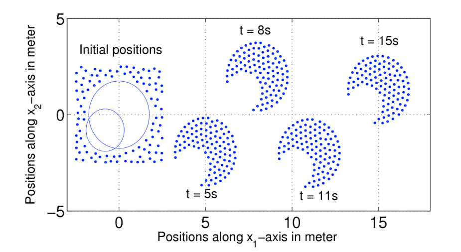

# 基于区域的机器人群阵型控制
>Region-based shape control for a swarm of robots

\begin{equation}
\int\limits_{-\infty}^\infty f(x) \delta(x - x_0) dx = f(x_0)
\end{equation}

我们考虑一组 $N$ 个启动的移动机器人，其具有 $`n`$ 个自由度的第 \( i \) 个机器人的动力学模型可以描述为（Fossen，1994; Slotine＆Li，1991）：


`Chien Chern Cheah`, `Saing Paul Hou`, and `Jean Jacques E. Slotine`

<p>
<details>
<summary>Chien Chern Cheah</summary>

School of Electrical and Electronic Engineering, Nanyang Technological University, Block S1, Nanyang Avenue, S(639798), Republic of Singapore

Chien Chern Cheah was born in Singapore. He received B.Eng. degree in Electrical Engineering from National University of Singapore in 1990, M.Eng. and Ph.D. degrees in Electrical Engineering, both from Nanyang Technological University, Singapore, in 1993 and 1996, respectively.

From 1990 to 1991, he worked as a design engineer in Chartered Electronics Industries, Singapore. He was a research fellow in the Department of Robotics, Ritsumeikan University, Japan from 1996 to 1998. He joined the School of Electrical and Electronic Engineering, Nanyang Technological University as an assistant professor in 1998. Since 2003, he has been an associate professor in Nanyang Technological University. In November 2002, he received the oversea attachment fellowship from the Agency for Science, Technology and Research (A*STAR), Singapore to visit the Nonlinear Systems laboratory, Massachusetts Institute of Technology.

He was the program chair of the International Conference on Control, Automation, Robotics and Vision 2006. He has served as an associate editor of the IEEE Robotics and Automation Society Conference Editorial Board since 2007.

</details>
</p>

<p>
<details>
<summary>Saing Paul Hou</summary>

School of Electrical and Electronic Engineering, Nanyang Technological University, Block S1, Nanyang Avenue, S(639798), Republic of Singapore

Saing Paul Hou was born in Kandal, Cambodia in 1982. He received B.Eng. degree with first class honor in Electrical and Electronic Engineering from Nanyang Technological University, Singapore in 2006. He was the recipient of Control Chapter Book Prize and Motorola Book Prize in 2006. He has been pursuing his Ph.D. degree at Nanyang Technological University, Singapore since 2006. His research interests include formation control of multi-robot systems and adaptive control.

</details>
</p>

<p>
<details>
<summary>Jean Jacques E. Slotine</summary>

Nonlinear Systems Laboratory, Massachusetts Institute of Technology, 77 Massachusetts Avenue, Cambridge, MA 02139, USA

Jean-Jacques E. Slotine was born in Paris in 1959, and received his Ph.D. from the Massachusetts Institute of Technology in 1983. After working at Bell Labs in the computer research department, in 1984 he joined the faculty at MIT, where he is now Professor of Mechanical Engineering and Information Sciences, Professor of Brain and Cognitive Sciences, and Director of the Nonlinear Systems Laboratory. He is the co-author of the textbooks “Robot Analysis and Control” (Wiley, 1986) and “Applied Nonlinear Control” (Prentice-Hall, 1991). Prof. Slotine was a member of the French National Science Council from 1997 to 2002, and is a member of Singapore’s A*STAR Sign Advisory Board.

</details>
</p>

https://www.sciencedirect.com/science/article/pii/S0005109809003215

## Abstract

本文介绍了一种用于机器人群的基于区域的形状控制器。在该控制方法中，机器人在期望区域内组团移动，同时保持它们之间的最小距离。通过选择适当的目标函数，可以形成各种形状的期望区域。组团中的机器人只需要与邻近的机器人通讯，而不是与整个团体进行通信。机器人在组内没有特定的身份或角色。因此，所提出的方法不需要限定机器人在该区域内的特定顺序或位置，故一群机器人可以形成不同的构造。本文采用类Lyapunov函数对多机器人系统进行收敛性分析。其仿真结果说明了本文提出的控制器的性能。
>This paper presents a region-based shape controller for a swarm of robots. In this control method, the robots move as a group inside a desired region while maintaining a minimum distance among themselves. Various shapes of the desired region can be formed by choosing the appropriate objective functions. The robots in the group only need to communicate with their neighbors and not the entire community. The robots do not have specific identities or roles within the group. Therefore, the proposed method does not require specific orders or positions of the robots inside the region and yet different formations can be formed for a swarm of robots. A Lyapunov-like function is presented for convergence analysis of the multi-robot systems. Simulation results illustrate the performance of the proposed controller.

## Keywords
Shape control; Co-operative control; Region following; Trajectory tracking; Adaptive control; Lyapunov stability

## I.INTRODUCTION
近几十年来，多机器人系统的协同控制（Murray，2007）一直是广泛研究的论题。在基于行为的多机器人控制（Balch＆Arkin，1998; Lawton，Beard，＆Young，2003; Reif＆Wang，1999; Reynolds，1987）一文中，学者成功控制机器人个体作出了一整套期望的动作。文章通过定义所有行为的相对重要性，从而形成了多机器人系统的一些整体行为。然而，这种方法的主要问题是难以在数学上分析整个系统，从而透彻理解机器人群的控制问题。与此同时，此方法也不可能得知系统是否收敛到了理想的状态。
>Cooperative control of multi-robot systems (Murray, 2007) has been the subject of extensive research in recent decades. In behavior-based control of multiple robots (Balch & Arkin, 1998; Lawton, Beard, & Young, 2003; Reif & Wang, 1999; Reynolds, 1987), a desired set of behaviors is implemented onto individual robots. By defining the relative importance of all the behaviors, the overall behavior of the multi-robot system is formed. The main problem of this approach is that it is difficult to analyze the overall system mathematically to gain insights into the control problems. It is also not possible to show that the system converges to a desired formation.

在领导者跟踪方法中（Consolini，Morbidi，Prattichizzo，＆Tosques，2008; Das et al。，2002; Desai，Kumar，＆Ostrowski，2001; Dimarogonas，Egerstedt，＆Kyriakopoulos，2006; Fredslund＆Mataric，2002; Ji， Ferrari-Trecate，Egerstedt，＆Buffa，2008; Ogren，Egerstedt，＆Hu，2002; Wang，1991），领导者被确定，并且追随者被设定为跟随他们各自的领导者。
>In leader-following approach (Consolini, Morbidi, Prattichizzo, & Tosques, 2008; Das et al., 2002; Desai, Kumar, & Ostrowski, 2001; Dimarogonas, Egerstedt, & Kyriakopoulos, 2006; Fredslund & Mataric, 2002; Ji, Ferrari-Trecate, Egerstedt, & Buffa, 2008; Ogren, Egerstedt, & Hu, 2002; Wang, 1991), the leaders are identified and the followers are defined to follow their respective leaders.

通常，跟随者需要保持自身与领导者之间的期望距离与方向，因此而形成的阵型是死板的。为了解决这个问题，文章提出了几种方法，比如允许追随者相对于领导者的位置可以灵活一些（Consolini等，2008; Dimarogonas等，2006; Ji等，2008）。Consolini等人（2008）认为，跟随者可以沿着以领导者位置为中心的圆改变其位置，不过跟随者和领导者之间的距离仍然是固定的。
>Generally, the followers need to maintain a desired distance and orientation to their respective leaders and hence the formation is rigid. To alleviate this problem, several approaches are proposed to allow some flexibility on the positions of the followers with respect to the leaders (Consolini et al., 2008; Dimarogonas et al., 2006; Ji et al., 2008). In Consolini et al. (2008), the follower can vary its position along a circular arc centered at the leader position but the distance between the follower and the leader is still fixed.

而Dimarogonas（2006）和Ji等人（2008）认为，几个领导者首先应当建立起静态阵型，然后再命令跟随者留在领导者形成的多面体内。然而，多面体的形状取决于领导者的数量。部署太少的领导者限制了团队最后呈现的阵型，而太多的领导者增加了控制问题的复杂性。这是因为在这个问题情形下，必须先为领导者建立一个编队控制器以确保其形成多面体阵型。相比基于行为的多机器人控制而言，领导者跟踪方法更容易分析，但最显著的问题是领导者机器人的崩溃导致整个系统的崩溃。
 >In Dimarogonas et al. (2006) and Ji et al. (2008) several leaders are first used to establish a static formation and the followers are then commanded to stay within the polytope formed by the leaders. However, the shape of the polytope depends on the number of leaders. The deployment of too few leaders limits the shape of the group while too many leaders increases the complexity of the control problem since it is necessary to first establish a formation controller for the leaders themselves to form the polytope. The leader–following approach is easier to analyze but one obvious problem is that the failure of one robot (i.e. leader) leads to the failures of the entire system.


 在虚拟结构方法中（Egerstedt＆Hu，2001; Lewis＆Tan，1997; Ren＆Beard，2004），整个阵型被认为是单个实体，并且阵型期望的运动被分配给结构。这种阵型组织方法非常严格，因为系统中机器人之间在运动过程中必须严格保持一定的几何关系，因此，阵型通常不可能随时间变化。除此之外，避障也是一个问题。很显然，虚拟结构方法不适合控制大量机器人，因为随着机器人数量的增加，机器人之间的约束关系变得更加复杂。
 >In the virtual structure method (Egerstedt & Hu, 2001; Lewis & Tan, 1997; Ren & Beard, 2004), the entire formation is considered as a single entity and desired motion is assigned to the structure. The formation in this approach is very rigid as the geometric re- lationship among the robots in the system must be rigidly main- tained during the movement. Therefore, it is generally not possible for the formation to change with time, and obstacle avoidance is also a problem. The virtual structure approaches are not suitable for controlling a large group of robots because the constraint re- lationships among robots become more complicated as the num- ber of robots in the group increases.

控制一组机器人以形成阵型的另一种方法是使用约束函数（Ihle，Jouffroy，＆Fossen，2006; Zhang＆Hu，2008; Zou，Pagilla，＆Misawa，2007）。这种方法与虚拟结构方法具有类似的问题。由于机器人相互间的约束关系的复杂程度随着机器人数量的增加而增加，因此这种方法也不适合控制大量机器人。
>Another method to control a group of robots to establish a formation is by using constraint func- tions (Ihle, Jouffroy, & Fossen, 2006; Zhang & Hu, 2008; Zou, Pagilla, & Misawa, 2007). This approach has a similar problem as the virtual structure method because the complexity of the constraint rela- tionships increases as the number of robots increases and hence is also not suitable for controlling a large group of robots.

为了控制大量机器人，通常使用潜在场方法（Gazi，2005; Leonard＆Fiorelli，2001; Olfati-Saber，2006; Pereira＆Hsu，2008）。然而，这种方法难以形成整体的阵型，因为机器人仅被命令以组为单位呆在一起，以及避免它们之间的碰撞。
>To control a large group of robots, the potential field approach (Gazi, 2005; Leonard & Fiorelli, 2001; Olfati-Saber, 2006; Pereira & Hsu, 2008) is normally used. However, it is difficult to form a desired shape for the swarm system as the robots are only commanded to stay close together as a group and avoid collision among themselves.

Belta和Kumar（2004）提出了一种控制方法，可以让大量机器人沿着指定路径移动。然而，由于整个组的阵型取决于组中机器人的数量，因此该控制策略也无法控制所需阵型。对于大量机器人，阵型固定为椭圆形，而对于少数机器人，阵型固定为矩形。
 >Belta and Kumar (2004) propose a control method for a large group of robots to move along a specified path. However, this proposed con- trol strategy also has no control over the desired formation since the shape of the whole group is dependent on the number of the robots in the group. For large numbers of robots, the formation is fixed as an elliptical shape, whereas for a small number of robots the formation is fixed as a rectangular shape.

 在本文中，我们为机器人群设计了一个基于区域的控制器。在我们提出的控制方法中，组中的每个机器人作为一组（全局目标）在移动区域内运动，并且同时保持彼此的最小距离（局部目标）。期望的区域可以被指定为各种形状，因此可以形成不同的形状和阵型。该组中的机器人只需要与邻近的机器人沟通，而不是和整个组群沟通。机器人在组内没有特定的身份或角色。因此，我们所提出的方法不需要限定机器人在区域内有特定次序或位置，从而由给定的一组机器人可以形成不同的阵型。在阵型控制系统的稳定性分析中，本文也考虑了机器人的动力学模型。此外，倘若任何机器人都可以进入或离开阵型、且不影响其他机器人，说明该系统是可扩展的。Lyapunov理论用于证明多机器人系统的稳定性。其仿真结果用于说明所提出的阵型控制器的性能。
 >In this paper, we propose a region-based controller for a swarm of robots. In our proposed control method, each robot in the group stays within a moving region as a group (global objective) and, at the same time, maintains a minimum distance from each other (local objective). The desired region can be specified as various shapes, hence different shapes and formations can be formed. The robots in the group only need to communicate with their neigh- bors and not the entire community. The robots do not have spe- cific identities or roles within the group. Therefore, the proposed method does not require specific orders or positions of the robots inside the region and hence different shapes can be formed by a given swarm of robots. The dynamics of the robots are also consid- ered in the stability analysis of the formation control system. The system is scalable in the sense that any robot can move into the for- mation or leave the formation without affecting the other robots. Lyapunov theory is used to show the stability of the multi-robot systems. Simulation results are presented to illustrate the perfor- mance of the proposed shape controller.

## II. Region-based shape controls
我们考虑一组``N``个启动的移动机器人，其具有``n``个自由度的第 \(i\) 个机器人的动力学模型可以描述为（Fossen，1994; Slotine＆Li，1991）：
>We consider a group of N fully actuated mobile robots whose dynamics of the ith robot with n degrees of freedom can be de- scribed as (Fossen, 1994; Slotine & Li, 1991):

```math
M_{i}\left(x_{i}\right) \ddot{x}_{i}+C_{i}\left(x_{i}, \dot{x}_{i}\right) \dot{x}_{i}+D_{i}\left(x_{i}\right) \dot{x}_{i}+g_{i}\left(x_{i}\right)=u_{i}\tag{1}
```


其中$`x_{i}\in R^{n}`$是广义坐标。$`M_i(x_i)\in R^{n \times n}`$是惯性矩阵，所以是对称且正定的，$`C_i(x_i，\dot{x_i})\in R^{n \times n}`$是科里奥利矩阵，并且向心项中的$`\dot{M}_{i}\left(x_{i}\right)-2 C_{i}\left(x_{i}, \dot{x}_{i}\right)`$是偏斜对称的，$`D_{i}\left(x_{i}\right) \dot{x}_{i}`$表示阻尼力，其中$`D_{i}\left(x_{i}\right) \in R^{n \times n}`$是正定，$`g_{i}\left(x_{i}\right) \in R^{n}`$表示重力矢量，$`u_{i} \in R^{n}`$表示控制输入。
>where $`x_{i} \in R^{n}`$ is a generalized coordinate, $`M_i（x_i）\in R^{n \times n}`$ is an inertia matrix which is symmetric and positive definite, $`C_i（x_i，\dot{x_i}）\in R^{n \times n}`$is a matrix of Coriolis and centripetal terms where $`\dot{M}_{i}\left(x_{i}\right)-2 C_{i}\left(x_{i}, \dot{x}_{i}\right)`$ is skew symmetric, $`D_{i}\left(x_{i}\right) \dot{x}_{i}`$ represents the damping force where $`D_{i}\left(x_{i}\right) \in R^{n \times n}`$ is positive definite, $`g_{i}\left(x_{i}\right) \in R^{n}`$ denotes a gravitational force vector, and $`u_{i} \in R^{n}`$ denotes the control inputs.

在传统的机器人控制中，期望目标被设定为位置（Arimoto，1996; Takegaki＆Arimoto，1981）或轨迹（Slotine＆Li，1987）。随着控制问题扩展到更复杂的系统，例如多个机器人的编队控制，该公式需要所有机器人具体的目标位置或相对位置。因此，当前在文献中讨论控制方法不适合于控制一大群机器人。近期，有学者提出了一种区域到达控制器，主要用于单个机器人的控制，其期望的区域是静态的（Cheah，Wang，＆Sun，2007）。
>In conventional robot control, the desired objective is specified as a position (Arimoto, 1996; Takegaki & Arimoto, 1981) or a trajectory (Slotine & Li, 1987). As the control problem is extended to a more complex system such as formation control of multiple robots, this formulation requires the specifications of the desired positions or relative positions of all the robots. Therefore, the current formation control methods discussed in the literature are not suitable for controlling a large group or swarm of robots. A region reaching controller has been recently proposed for a single robot manipulator where the desired region is static (Cheah, Wang, & Sun, 2007).

在本节中，我们将介绍一种基于区域的多机器人系统的阵型控制器。首先，应当确定一个特定阵型的移动区域，以便所有机器人都留在里面。这可以被视为所有机器人的全局目标。其次，指定每个机器人与其相邻机器人之间的最小距离。这可以被视为每个机器人的局部目标。因此，该组机器人能够以期望的阵型移动，同时保持彼此之间的最小距离。
让我们通过以下不等式来定义全局目标函数：
>In this section, we present a region-based shape controller for multi-robot systems. First, a moving region of specific shape is de- fined for all the robots to stay inside. This can be viewed as a global objective of all robots. Second, a minimum distance is specified be- tween each robot and its neighboring robots. This can be viewed as a local objective of each robot. Thus, the group of robots will be able to move in a desired shape while maintaining a minimum distance among each other.
Let us define a global objective function by the following inequality:

```math
f_{G}\left(\Delta x_{i}\right)=\left[f_{G 1}\left(\Delta x_{i o 1}\right), f_{G 2}\left(\Delta x_{i o 2}\right), \ldots, f_{\mathrm{GM}}\left(\Delta x_{i o M}\right)\right]^{\mathrm{T}} \leq 0 \tag{2}
```

其中$`\Delta x_{i o l}=x_{i}-x_{o l}, x_{o l}(t)`$是第$`l`$个所需区域内的参考点，$`l = 1,2，\dots，M `$，$`M`$是目标函数的总数， $`f_{G l}\left(\Delta x_{i o l}\right)`$是连续的标量函数，具有连续偏导数满足当 $`\left\|\Delta x_{i o l}\right\| \rightarrow \infty`$ 时 ，$`\left|f_{G l}\left(\Delta x_{i o l}\right)\right| \rightarrow \infty`$ 。$`f_{G l}\left(\Delta x_{i o l}\right)`$ 的选取标准是满足$`f_{G}\left(\Delta x_{i o l}\right)`$有界性，从而保证$`\frac{\partial f_{G l}\left(\Delta x_{i o l}\right)}{\partial \Delta x_{i o l}}`$ 和$`\frac{\partial^{2} f_{G l}\left(\Delta x_{\text { iol }}\right)}{\partial \Delta x_{\text {iol}}^{2}}`$的有界性。

>where$`\Delta x_{i o l}=x_{i}-x_{o l}, x_{o l}(t)`$ is a reference point within the lth desired region, $`l=1,2, \dots, M`$, $`M`$ is the total number of objective functions, $`f_{G l}\left(\Delta x_{i o l}\right)`$ are continuous scalar functions with continuous partial derivatives that satisfy $`\left|f_{G l}\left(\Delta x_{i o l}\right)\right| \rightarrow \infty`$ as $`\left\|\Delta x_{i o l}\right\| \rightarrow \infty`$. $`f_{G l}\left(\Delta x_{i o l}\right)`$ is chosen in such a way that the boundedness of $`f_{G}\left(\Delta x_{i o l}\right)`$ ensures the boundedness of $`\frac{\partial f_{G l}\left(\Delta x_{i o l}\right)}{\partial \Delta x_{i o l}}`$ ,$`\frac{\partial^{2} f_{G l}\left(\Delta x_{\text { iol }}\right)}{\partial \Delta x_{\text {iol}}^{2}}`$.

选择单个区域的每个参考点作为彼此的常数偏移，以满足$`\dot{x}_{ol}=\dot{x}_{o}`$，其中$`\dot{x}_{o}`$是所需区域的速度。通过选择合适的函数，可以形成圆形，椭圆形，月牙形，环形，三角形，正方形等各种阵型。例如，可以通过选择目标函数来形成环形阵型，如下所示：
>Each reference point of the individual region is chosen to be a con- stant offset of one another so that $`\dot{x}_{o l}=\dot{x}_{o}`$, where $`\dot{x}_{o}`$ is the speed of the desired region. Various shapes such as circle, ellipse, crescent, ring, triangle, square etc. can be formed by choosing the appropri- ate functions. For example, a ring shape can be formed by choosing the objective functions as follows:

```math
\begin{array}{l}{f_{1}\left(\Delta x_{i o1}\right)=r_{1}^{2}-\left(x_{i 1}-x_{o 11}\right)^{2}-\left(x_{i 2}-x_{o12}\right)^{2} \leq 0} \\ {f_{2}\left(\Delta x_{i o2}\right)=\left(x_{i 1}-x_{o11}\right)^{2}+\left(x_{i 2}-x_{o12}\right)^{2}-r_{2}^{2} \leq 0}\end{array}\tag{3}
```
其中$`x_{i}=\left[x_{i 1}, x_{i 2}\right]^{\mathrm{T}}`$，$`r_1`$和$`r_2`$是两个圆的半径，其中半径为常数，且满足$`r_{1}<r_{2}`$，$`\left(x_{o11}(t), x_{o12}(t)\right)`$代表两个圆的共同中心。目标区域的一些示例如图1所示。
>where $`x_{i}=\left[x_{i 1}, x_{i 2}\right]^{\mathrm{T}}`$ , $`r_1`$ and $`r_2`$ are the constant radii of two circles such that $`r_{1}<r_{2}`$ , $`\left(x_{o11}(t), x_{o12}(t)\right)`$ represents the common center of the two circles. Some examples of the desired regions are shown in Fig. 1.



`图 1` :目标区域示例
>`Fig.1.` :Examples of desired regions.

涉及机器人$`i`$的全局目标函数的势能函数定义如下：
>The potential energy function of the global objective functions involving robot i is defined as follows:

```math
\begin{aligned} P_{G i}\left(\Delta x_{i o l}\right) &=\sum_{l=1}^{M} \frac{k_{l}}{2}\left[\max \left(0, f_{G l}\left(\Delta x_{i o l}\right)\right)\right]^{2} \\ &=\sum_{l=1}^{M} P_{G l}\left(\Delta x_{i o l}\right) \end{aligned}\tag{4}
```

其中
>where

```math
P_{G l}\left(\Delta x_{i o l}\right)=\left\{\begin{array}{ll}{0} & {f_{G l}\left(\Delta x_{i o l}\right) \leq 0} \\ {\frac{k_{l}}{2} f_{G l}^{2}\left(\Delta x_{i o l}\right)} & {f_{G l}\left(\Delta x_{i o l}\right)>0}\end{array}\right.\tag{5}
```

和$`k_l`$是正的常数。
对势能函数（4）和（5）求关于$`\Delta x_{i o l}`$的偏导后，我们有：
>and $`k_l`$ are positive constants.
Partial differentiating the potential energy function described by Eqs. (4) and (5) with respect to $`\Delta x_{i o l}`$ we have:

```math
\frac{\partial P_{G l}\left(\Delta x_{i o l}\right)}{\partial \Delta x_{i o l}}=\sum_{l=1}^{M} \frac{\partial P_{G l}\left(\Delta x_{i o l}\right)}{\partial \Delta x_{i o l}}\tag{6}
```
其中
>where

```math
\frac{\partial P_{G l}\left(\Delta x_{i o l}\right)}{\partial \Delta x_{i o l}}=\left\{\begin{array}{ll}{0} & {f_{G l}\left(\Delta x_{i o l}\right) \leq 0} \\ {k_l f_{G l}\left(\Delta x_{i o l}\right)\left(\frac{\partial f_{G l}\left(\Delta x_{i o l}\right)}{\partial \Delta x_{i o l}}\right)^{T}} & {f_{G l}\left(\Delta x_{i o l}\right)>0}\end{array}\right.
```
上述等式可写为：
>The above equations can be written as:

```math
\begin{aligned} \frac{\partial P_{G i}\left(\Delta x_{i o l}\right)}{\partial \Delta x_{i o l}} &=\sum_{l=1}^{M} k_{l} \max \left(0, f_{G l}\left(\Delta x_{i o l}\right)\right)\left(\frac{\partial f_{G l}\left(\Delta x_{i o l}\right)}{\partial \Delta x_{i o l}}\right)^{T} \\ & \triangleq \Delta \xi_{i} \end{aligned}\tag{7}
```

从方程式（7）中可以看出，$`\frac{\partial f_{G l}\left(\Delta x_{i o l}\right)}{\partial \Delta x_{i o l}}`$是连续的，因为$`f_{G l}\left(\Delta x_{i o l}\right)`$是连续的，$`f_{G l}\left(\Delta x_{i o l}\right)`$接近零时，$`x_i`$接近目标区域的（即$`f_{G l}\left(\Delta x_{i o l}\right)`$）的边界，当$`x_i`$在区域内时，它保持为零。
>As seen from Eq. (7), $`\frac{\partial f_{G l}\left(\Delta x_{i o l}\right)}{\partial \Delta x_{i o l}}`$ is continuous because $`f_{G l}\left(\Delta x_{i o l}\right)`$ is continuous and $`f_{G l}\left(\Delta x_{i o l}\right)`$ approaches zero as $`x_i`$ approaches the
boundary of the desired region (i.e. $`f_{G l}\left(\Delta x_{i o l}\right)`$) and it remains as zero when $`x_i`$ is inside the region.

注意，当机器人在目标区域之外时，控制力$`\Delta \xi_{i}`$由等式（7）被激活以将机器人$`i`$吸引到期望的区域。当机器人在所需区域内时，则$`\Delta \xi_{i}=0`$。
>Note that when the robot is outside the desired region, the control force $`\Delta \xi_{i}`$ described by Eq. (7) is activated to attract the robot $`i`$ toward the desired region. When the robot is inside the desired region, then $`\Delta \xi_{i}=0`$.

接下来，我们通过以下不等式定义机器人之间的最小距离：
>Next, we define a minimum distance between robots by the following inequality:

```math
g_{L i j}\left(\Delta x_{i j}\right)=r^{2}-\left\|\Delta x_{i j}\right\|^{2} \leq 0 \tag{8}
```

其中$`\Delta x_{i j}=x_{i}-x_{j}`$是机器人$`i`$和机器人$`j`$之间的距离，$`r`$是两个机器人之间的最小距离，如图2所示。为简单起见，所有机器人之间的最小距离选择为相同的。 可以从上面的不等式看出，函数$`g_{L i j}\left(\Delta x_{i j}\right)`$是二次可偏导的。
>where $`\Delta x_{i j}=x_{i}-x_{j}`$ is the distance between robot $`i`$ and robot $`j`$ and $`r`$ is a minimum distance between the two robots as illustrated in Fig. 2. For simplicity, the minimum distance between robots is chosen to be the same for all the robots. Note from the above inequality that the function $`g_{L i j}\left(\Delta x_{i j}\right)`$ is twice partially differentiable.



`图2`:机器人间的最小距离
>`Fig.2.` :Minimum distance between robots`

从等式8中可以很明显地看出
>From Eq. (8), it is clear that

```math
g_{L i j}\left(\Delta x_{i j}\right)=g_{L j i}\left(\Delta x_{j i}\right)\tag{9}
```
并且
>and

```math
\frac{\partial g_{L i j}\left(\Delta x_{i j}\right)}{\partial \Delta x_{i j}}=-\frac{\partial g_{L j i}\left(\Delta x_{j i}\right)}{\partial \Delta x_{j i}}\tag{11}
```

局部目标函数（8）的势能定义为：
>A potential energy for the local objective function (8) is defined as:

```math
Q_{L i j}\left(\Delta x_{i j}\right)=\sum_{j \in N_{i}} \frac{k_{i j}}{2}\left[\max \left(0, g_{L i j}\left(\Delta x_{i j}\right)\right)\right]^{2}\tag{11}
```

其中$`k_{ij}`$是正常数，$`N_i`$是机器人$`i`$周围的邻近机器人集合。所有与机器人$`i`$的距离小于$`r_N`$的机器人都被称为机器人$`i`$的邻近机器人。$`r_N`$是一个正数，并且满足条件$`r_N>r`$。 对式（11）求关于$`x_{ij}`$的偏导，我们得到
>where $`k_{ij}`$ are positive constants and $`N_i`$ is a set of neighbors around robot $`i`$. Any robot that is at a distance smaller than $`r_N`$ from robot $`i`$ is called neighbor of robot $`i`$.$`r_N`$ is a positive number satisfy the condition $`r_N>r`$ . Partial differentiating Eq. (11) with respect to $`x_{ij}`$ , we get

```math
\begin{aligned} \frac{\partial Q_{L i j}\left(\Delta x_{i j}\right)}{\partial \Delta x_{i j}} &=\sum_{j \in N_{i}} k_{i j} \max \left(0, g_{L i j}\left(\Delta x_{i j}\right)\right)\left(\frac{\partial g_{L i j}\left(\Delta x_{i j}\right)}{\partial \Delta x_{i j}}\right)^{\mathrm{T}} \\ & \triangleq \Delta \rho_{i j} \end{aligned}\tag{12}
```

从式（12）中可以看出$`\frac{\partial Q_{L i j}\left(\Delta x_{i j}\right)}{\partial \Delta x_{i j}}`$是连续的。值得注意的是，$`\Delta \rho_{i j}`$是由其相邻机器人作用在机器人$`i`$上的控制合力。当机器人$`i`$与邻近机器人保持最小距离$`r`$时，则$`\Delta \rho_{i j}=0`$。当且仅当机器人$`i`$与其任何邻近机器人之间的距离小于最小距离$`r`$时，才激活控制力$`\Delta \rho_{i j}`$。我们考虑每对相邻机器人之间力的作用是相互的。也就是说，如果机器人$`i`$与机器人$`j`$远离一段距离，那么机器人$`j`$也与机器人$`i`$远离一段距离。
>Similarly,$`\frac{\partial Q_{L i j}\left(\Delta x_{i j}\right)}{\partial \Delta x_{i j}}`$ is continuous as seen from Eq. (12). Note that $`\Delta \rho_{i j}`$ is a resultant control force acting on robot $`i`$ by its neighboring robots. When robot $`i`$ maintains minimum distance $`r`$ from its neigh- boring robots, then $`\Delta \rho_{i j}=0`$. The control force $`\Delta \rho_{i j}`$ is activated only when the distance between robot $`i`$ and any of its neighboring robots is smaller than the minimum distance $`r`$ . We consider a bidirectional interactive force between each pair of neighbors. That is, if robot $`i`$ keeps a distance from robot $`j`$ then robot $`j`$ also keeps a distance from robot $`i`$.

接下来，我们将向量$`\dot{x}_{r i}`$定义为
>Next, we define a vector $`\dot{x}_{r i}`$ as

```math
\dot{x}_{r i}=\dot{x}_{0}-\alpha_{i} \Delta \xi_{i}-\gamma \Delta \rho_{i j}(13)
```

其中$`\Delta \xi_{i}`$为方程式（7）中的定义，$`\Delta \rho_{i j}`$为方程式（12）中定义，$`\alpha_{i}`$和$`\gamma`$是正常数。
>where $`\Delta \xi_{i}`$ is defined in Eq. (7), $`\Delta \rho_{i j}`$ is defined in (12), $`\alpha_{i}`$ and $`\gamma`$ are positive constants.

令$`\Delta \epsilon_{i}=\alpha_{i} \Delta \xi_{i}+\gamma \Delta \rho_{i j}`$成立，我们有
>Let$`\Delta \epsilon_{i}=\alpha_{i} \Delta \xi_{i}+\gamma \Delta \rho_{i j}`$, we have

```math
\dot{x}_{r i}=\dot{x}_{o}-\Delta \epsilon_{i}\tag{14}
```

当机器人与其所有邻居保持最小距离时，机器人在所需区域内（如图3所示），然后$`\Delta \epsilon_{i}=0`$。对式（14）求关于时间的微分，我们得到：
>When robot i keeps a minimum distance from all its neighboring
robots inside the desired region (as illustrated in Fig. 3), then $`\Delta \epsilon_{i}=0`$. Differentiating Eq. (14) with respect to time we get`

```math
\ddot{x}_{r i}=\ddot{x}_{0}-\Delta \dot{\epsilon}_{i}(15)
```


`图3`:机器人$`i`$看到的理想区域
>`Fig.3.`: Desired region seen by robot $`i`$

然后将机器人$`i`$的滑动矢量定义为：
>A sliding vector for robot i is then defined as:

```math
s_{i}=\dot{x}_{i}-\dot{x}_{r i}=\Delta \dot{x}_{i}+\Delta \epsilon_{i}\tag{16}
```

其中$`\Delta \ddot{x}_{i}=\ddot{x}_{i}-\ddot{x}_{o}`$。 对方程（16）求时域微分
>where $`\Delta \ddot{x}_{i}=\ddot{x}_{i}-\ddot{x}_{o}`$. Differentiating Eq. (16) with respect to time yields

```math
\dot{s}_{i}=\ddot{x}_{i}-\ddot{x}_{r i}=\Delta \ddot{x}_{i}+\Delta \dot{\epsilon}_{i}\tag{17}
```
其中$`\Delta \ddot{x}_{i}=\ddot{x}_{i}-\ddot{x}_{O}`$。将等式（16）和等式（17）代入等式（1）
>where $`\Delta \ddot{x}_{i}=\ddot{x}_{i}-\ddot{x}_{o}`$. Substituting Eqs. (16) and (17) into Eq. (1) we have

```math
\begin{array}{l}{M_{i}\left(x_{i}\right) \dot{s}_{i}+C_{i}\left(x_{i}, \dot{x}_{i}\right) s_{i}+D_{i}\left(x_{i}\right) s_{i}+M_{i}\left(x_{i}\right) \ddot{x}_{r i}} \\ {\quad+C_{i}\left(x_{i}, \dot{x}_{i}\right) \dot{x}_{r i}+D_{i}\left(x_{i}\right) \dot{x}_{r i}+g_{i}\left(x_{i}\right)=u_{i}}\end{array}\tag{18}
```

我们在方程（18）等号左侧后四个量在动态参数$`\theta_{i}`$的集合中是线性的，因此可以被表示为（Slotine＆Li，1991）
>The last four terms on the left hand side of Eq. (18) are linear in a set of dynamic parameters $`\theta_{i}`$ and hence can be represented as (Slotine & Li, 1991)

```math
\begin{array}{l}{M_{i}\left(x_{i}\right) \ddot{x}_{r i}+C_{i}\left(x_{i}, \dot{x}_{i}\right) \dot{x}_{r i}+D_{i}\left(x_{i}\right) \dot{x}_{r i}+g_{i}\left(x_{i}\right)} \\ {\quad=Y_{i}\left(x_{i}, \dot{x}_{i}, \dot{x}_{r}, \ddot{x}_{r i}\right) \theta_{i}}\end{array}\tag{19}
```

其中$`Y_{i}\left(x_{i}, \dot{x}_{i}, \dot{x}_{n}, \ddot{x}_{r i}\right)`$是已知的回归矩阵。因此可以得出用于机器人群的，基于区域的阵型控制器
>where $`Y_{i}\left(x_{i}, \dot{x}_{i}, \dot{x}_{n}, \ddot{x}_{r i}\right)`$ is a known regressor matrix.
The region-based shape controller for a swarm of robots is proposed as

```math
u_{i}=-K_{s i} s_{i}-K_{p} \Delta \epsilon_{i}+Y_{i}\left(x_{i}, \dot{x}_{i}, \dot{x}_{r i}, \ddot{x}_{r i}\right) \hat{\theta}_{i}\tag{20}
```

$`K_{si}`$是正定矩阵，$`K_{p}=k_{p}`$，$`k_p`$是整的常数，$`I`$是一个单位矩阵。 估计参数 $`\hat{\theta}_{i}`$由下式更新
>where $`K_{si}`$ are positive definite matrices, $`K_{p}=k_{p}`$ $`k_p`$,  is a positive constant and $`I`$ is an identity matrix. The estimated parameters $`\hat{\theta}_{i}`$ are updated by

```math
\dot{\hat{\theta}}_{i}=-L_{i} Y_{i}^{\mathrm{T}}\left(x_{i}, \dot{x}_{i}, \dot{x}_{r i}, \ddot{x}_{r i}\right) s_{i}\tag{21}
```

其中$`L_i`$是正定矩阵
>where $`L_i`$ are positive definite matrices.

将方程（20）代入方程（18），得到闭环动力学方程。
>The closed-loop dynamic equation is obtained by substituting Eq. (20) into Eq. (18):

```math
\begin{array}{l}{M_{i}\left(x_{i}\right) \dot{s}_{i}+C_{i}\left(x_{i}, \dot{x}_{i}\right) s_{i}+D_{i}\left(x_{i}\right) s_{i}+K_{s i} s_{i}} \\ {\quad+Y_{i}\left(x_{i}, \dot{x}_{i}, \dot{x}_{r i}, \ddot{x}_{r i}\right) \Delta \theta_{i}+K_{p} \Delta \epsilon_{i}=0}\end{array}\tag{22}
```
其中$`\Delta \theta_{i}=\theta_{i}-\hat{\theta}_{i}`$。让我们为多机器人系统定义类Lyapunov的函数
>where $`\Delta \theta_{i}=\theta_{i}-\hat{\theta}_{i}`$. Let us define a Lyapunov-like function for the multi-robot system as

```math
\begin{aligned} V=& \sum_{i=1}^{N} \frac{1}{2} s_{i}^{\mathrm{T}} M_{i}\left(x_{i}\right) s_{i}+\sum_{i=1}^{N} \frac{1}{2} \Delta \theta_{i}^{\mathrm{T}} L_{i}^{-1} \Delta \theta_{i} \\ &+\sum_{i=1}^{N} \frac{1}{2} \alpha_{i} k_{p} \sum_{l=1}^{M} k_{l}\left[\max \left(0, f_{G l}\left(\Delta x_{i 0 l}\right)\right)\right]^{2} \\ &+\frac{1}{2} \sum_{i=1}^{N} \frac{1}{2} \gamma k_{p} \sum_{j \in N_{i}} k_{i j}\left[\max \left(0, g_{L i j}\left(\Delta x_{i j}\right)\right)\right]^{2} \end{aligned}\tag{23}
```

接下来，我们将继续表明类Lyapunov函数的导数是负半定的，然后使用Barbalat的引理来证明群系统的收敛性。根据时间对V求导数，并且使用等式7，21和22的结果。我们得到下式
>In the following development, we shall proceed to show that the derivative of the Lyapunov-like function is negative semi-definite and then use Barbalat’s lemma to prove the convergence of the swarm system. Differentiating V with respect to time and using Eq. (7), (21) and (22) we get

```math
\begin{aligned} \dot{V}=&-\sum_{i=1}^{N} s_{i}^{\mathrm{T}} K_{s i} s_{i}-\sum_{i=1}^{N} s_{i}^{\mathrm{T}} D_{i}\left(x_{i}\right) s_{i} \\ &-\sum_{i=1}^{N} s_{i}^{\mathrm{T}} k_{p} \Delta \epsilon_{i}+\sum_{i=1}^{N} \alpha_{i} k_{p} \Delta \dot{x}_{i}^{\mathrm{T}} \Delta \xi_{i} \\ &+\frac{1}{2} \sum_{i=1}^{N} \gamma k_{p} \sum_{j \in N_{i}} k_{i j} \Delta \dot{x}_{i j}^{\mathrm{T}} \max \left(0, g_{\text {lij}}\left(\Delta x_{i j}\right)\right)\left(\frac{\partial g_{\text {lij}}\left(\Delta x_{i j}\right)}{\partial \Delta x_{i j}}\right)^{\mathrm{T}} \end{aligned}\tag{24}
```

接下来，因为$`\Delta \dot{x}_{i j}=\dot{x}_{i}-\dot{x}_{j}=\left(\dot{x}_{i}-\dot{x}_{o}\right)-\left(\dot{x}_{j}-\dot{x}_{o}\right)=\Delta \dot{x}_{i}-\Delta \dot{x}_{j}`$，通过使用等式（12）的结果，等式24的最后一个参数可以写成
>Next,since $`\Delta \dot{x}_{i j}=\dot{x}_{i}-\dot{x}_{j}=\left(\dot{x}_{i}-\dot{x}_{o}\right)-\left(\dot{x}_{j}-\dot{x}_{o}\right)=\Delta \dot{x}_{i}-\Delta \dot{x}_{j}`$,by using Eq. (12), the last term of Eq. (24) can be written as

```math
\begin{aligned} \frac{1}{2} \sum_{i=1}^{N} \gamma k_{p} & \sum_{j \in N_{i}} k_{i j} \Delta \dot{x}_{i j}^{\mathrm{T}} \max \left(0, g_{L i j}\left(\Delta x_{i j}\right)\right)\left(\frac{\partial g_{L i j}\left(\Delta x_{i j}\right)}{\partial \Delta x_{i j}}\right)^{\mathrm{T}} \\=& \frac{1}{2} \sum_{i=1}^{N} \gamma k_{p} \Delta \dot{x}_{i}^{\mathrm{T}} \Delta \rho_{i j} \\ &-\frac{1}{2} \sum_{i=1}^{N} \gamma k_{p} \sum_{j \in N_{i}} k_{i j} \Delta \dot{x}_{j}^{\mathrm{T}} \max \left(0, g_{\text {Lij}}\left(\Delta x_{i j}\right)\right)\left(\frac{\partial g_{\text {Lij}}\left(\Delta x_{i j}\right)}{\partial \Delta x_{i j}}\right)^{\mathrm{T}} \end{aligned}\tag{25}
```

通过等式（9）和（10），我们注意到$`g_{L i j}\left(\Delta x_{i j}\right)=g_{L j i}\left(\Delta x_{j i}\right)`$和$`\frac{\partial g_{L i j}\left(\Delta x_{i j}\right)}{\partial \Delta x_{i j}}=-\frac{\partial g_{L j i}\left(\Delta x_{j i}\right)}{\partial \Delta x_{j i}}`$。因此将这些特性应用于方程（25）的最后一项。我们有
>From Eq. (9) and (10), we note that $`g_{L i j}\left(\Delta x_{i j}\right)=g_{L j i}\left(\Delta x_{j i}\right)`$ and $`\frac{\partial g_{L i j}\left(\Delta x_{i j}\right)}{\partial \Delta x_{i j}}=-\frac{\partial g_{L j i}\left(\Delta x_{j i}\right)}{\partial \Delta x_{j i}}`$.Therefore applying these properties to the last term of Eq.(25). We have

```math
\begin{aligned} \frac{1}{2} \sum_{i=1}^{N} \gamma k_{p} & \sum_{j \in N_{i}} k_{i j} \Delta \dot{x}_{i j}^{\mathrm{T}} \max \left(0, g_{L i j}\left(\Delta x_{i j}\right)\right)\left(\frac{\partial g_{L i j}\left(\Delta x_{i j}\right)}{\partial \Delta x_{i j}}\right)^{\mathrm{T}} \\=& \frac{1}{2} \sum_{i=1}^{N} \gamma k_{p} \Delta \dot{x}_{i}^{\mathrm{T}} \Delta \rho_{i j} \\ &+\frac{1}{2} \sum_{i=1}^{N} \gamma k_{p} \sum_{j \in N_{i}} k_{i j} \Delta \dot{x}_{j}^{\mathrm{T}} \max \left(0, g_{L j i}\left(\Delta x_{j i}\right)\right)\left(\frac{\partial g_{L i j}\left(\Delta x_{j i}\right)}{\partial \Delta x_{j i}}\right)^{\mathrm{T}} \end{aligned}(26)
```

由于每对邻居之间存在双向相互作用力，通过让$`k_{i j}=k_{j i}`$，上述等式的最后一项可写为
>Since there is a bidirectional interaction force between each pair of neighbors, by letting # , the last term of the above equation can be written as

```math
\frac{1}{2} \sum_{i=1}^{N} \gamma k_{p} \sum_{j \in N_{i}} k_{i j} \Delta \dot{x}_{j}^{\mathrm{T}} \max \left(0, g_{L j i}\left(\Delta x_{j i}\right)\right)\left(\frac{\partial g_{L j j}\left(\Delta x_{j j}\right)}{\partial \Delta x_{j i}}\right)^{\mathrm{T}}
```
```math
\begin{array}{l}{=\frac{1}{2} \sum_{j=1}^{N} \gamma k_{p} \sum_{i \in N_{j}} k_{j i} \Delta \dot{x}_{j}^{\mathrm{T}} \max \left(0, g_{L j}\left(\Delta x_{j i}\right)\right)\left(\frac{\partial g_{L j i}\left(\Delta x_{j i}\right)}{\partial \Delta x_{j i}}\right)^{\mathrm{T}}} \\ {=\frac{1}{2} \sum_{j=1}^{N} \gamma k_{p} \Delta \dot{x}_{j}^{\mathrm{T}} \Delta \rho_{j i}} \\ {=\frac{1}{2} \sum_{i=1}^{N} \gamma k_{p} \Delta \dot{x}_{i}^{\mathrm{T}} \Delta \rho_{i j}}\end{array}\tag{27}
```

其中$`N_j`$是机器人$`j`$的邻近机器人集合。因此，将方程（26）和（27）代入方程（24）类Lyapunov函数的时间导数，我们得到
>Where $`N_j`$ is the set of neighbors around robot $`j`$. Therefore, substituting Eq.(26) and (27) into the time derivative of the Lyapunov function in (24), we have

```math
\begin{aligned} \dot{V}=-& \sum_{i=1}^{N} s_{i}^{\mathrm{T}} K_{s ; S_{i}}-\sum_{i=1}^{N} s_{i}^{\mathrm{T}} D_{i}\left(x_{i}\right) S_{i}-\sum_{i=1}^{N} s_{i}^{\mathrm{T}} k_{p} \Delta \epsilon_{i} \\ &+\sum_{i=1}^{N} \alpha_{i} k_{p} \Delta \dot{x}_{i}^{\mathrm{T}} \Delta \xi_{i}+\sum_{i=1}^{N} \gamma k_{p} \Delta \dot{x}_{i}^{\mathrm{T}} \Delta \rho_{i j} \end{aligned}\tag{28}
```
最后，将方程（16）代入方程（28），我们得到了
>Finnally, substituting Eq.(16) into Eq.(28) we get

```math
\begin{aligned} \dot{V}=&-\sum_{i=1}^{N} s_{i}^{\mathrm{T}} K_{s i} s_{i}-\sum_{i=1}^{N} s_{i}^{\mathrm{T}} D_{i}\left(x_{i}\right) s_{i} \\ &-\sum_{i=1}^{N} k_{p} \Delta \epsilon_{i}^{\mathrm{T}} \Delta \epsilon_{i} \leq 0 \end{aligned}\tag{29}
```

我们准备陈述以下理论：
>We are ready to state the following theroem:

<b>定理</b>。考虑一组N个机器人，其运动规律遵循方程（1）描述的动力学方程。自适应控制定律（20）和参数更新定律（21）引起$`\Delta \epsilon_{i} \rightarrow 0`$和当$`t \rightarrow \infty`$ 对所有的$`i=1,2, \ldots, N`$式$`\Delta \dot{x}_{i} \rightarrow 0`$的收敛
>Theorem. Consider a group of N robots with dynamic equations described by (1), the adaptive control laws (20) and the parameter update laws (21) give rise to the convergence of $`\Delta \epsilon_{i} \rightarrow 0`$ and $`\Delta \dot{x}_{i} \rightarrow 0`$ for all $`i=1,2, \ldots, N`$,as $`t \rightarrow \infty`$.

  <b>证明</b>。通过等式（29），我们可以得出结论：$`s_i`$和$`\Delta \epsilon_{i} \in L^{2}`$以及$`\Delta \theta_{i}`$是有界的。对方程（7）和（12）求导，可以证明$`\Delta \dot{\xi}_{i}`$和$`\Delta \dot{\rho}_{i j}`$是有界的，因此$`\Delta \dot{\epsilon}_{i}`$也是有界的。从等式（15）中可推断，如果$`\ddot{x}_{o}`$有界，则$`\ddot{x}_{r i}`$是有界的。从闭环方程。 （22），我们可以得出结论，$`\dot{\mathrm{s}}_{i}`$是有界的。应用Barbalat的引理（Slotine＆Li，1991），我们得到$`\Delta \epsilon_{i} \rightarrow 0`$以及当$`t \rightarrow \infty`$时$`s_{i} \rightarrow 0`$。通过等式（16），$`\Delta \dot{x}_{i} \rightarrow 0`$。
>Proof. From Eq. (29), we can conclude that $`s_i`$ and $`\Delta \epsilon_{i} \in L^{2}`$ and $`\Delta \theta_{i}`$ is bounded. Differentiating Eq. (7) and (12), it can be shown that
$`\Delta \dot{\xi}_{i}`$ and $`\Delta \dot{\rho}_{i j}`$ are bounded and hence $`\Delta \dot{\epsilon}_{i}`$ is bounded. From Eq. (15), $`\ddot{x}_{r i}`$ is bounded if $`\ddot{x}_{o}`$ is bounded. From the closed-loop Eq. (22), we can conclude that $`\dot{\mathrm{s}}_{i}`$ is bounded. Applying Barbalat’s lemma (Slotine &Li,1991),we have $`\Delta \epsilon_{i} \rightarrow 0`$ and $`s_{i} \rightarrow 0`$ as $`t \rightarrow \infty`$. From Eq.(16), $`\Delta \dot{x}_{i} \rightarrow 0`$.

因为
>Since

```math
\Delta \epsilon_{i}=\alpha_{i} \Delta \xi_{i}+\gamma \Delta \rho_{i j}=0\tag{30}
```
由于$`t \rightarrow \infty`$时，因此对所有的误差项取和
>as $`t \rightarrow \infty`$, therefore summing all the error terms yields

```math
\sum_{i=1}^{N} \alpha_{i} \Delta \xi_{i}+\sum_{i=1}^{N} \gamma \Delta \rho_{i j}=0\tag{31}
```

注意，机器人之间的力是相互的，这些力相互抵消，且多机器人系统中所有相互作用力的总和为零（即$`\sum_{i=1}^{N} \Delta \rho_{i j}=0`$）。通过等式（31），我们可以得出
>Note that the interactive forces between robots are bi-directional
and these forces cancel each other out and the summation of all the interactive forces in the multi-robot systems is zero (i.e. 􏰄$`\sum_{i=1}^{N} \Delta \rho_{i j}=0`$). From Eq. (31), we have

```math
\sum_{i=1}^{N} \alpha_{i} \Delta \xi_{i}=0\tag{32}
```

上述等式的一个简单解决方案是对于所有$`i`$，$`\Delta \xi_{i}=0`$。如果
所有机器人最初都在目标区域内，则它们将一直保持在目标区域，因为从式（29）可以看出$`\dot{V} \leq 0`$。因此通过等式（30），我们有$`\Delta \rho_{i j}=0`$.这意味着每个机器人都在目标的区域内，同时它们之间保持最小距离。接下来，假设$`\Delta \xi_{i} \neq 0`$是（32）的解。如果$`\Delta \xi_{i} \neq 0`$，则机器人在目标区域之外。如果机器人位于目标区域的一侧，则$`\Delta \xi_{i}`$沿某个轴具有相同的符号，因此它们不能相互抵消。这与􏰄$`\sum_{i=1}^{N} \alpha_{i} \Delta \xi_{i}=0`$的事实相矛盾。因此，$`\sum_{i=1}^{N} \alpha_{i} \Delta \xi_{i}=0`$的唯一可能性是当每个项$`\Delta \xi_{i}=0`$时。 通过式（30），我们有$`\Delta \rho_{i j}=0`$.因此，当且仅当所有的力$`\Delta \xi_{i}`$为零或相互抵消时，􏰄$`\sum_{i=1}^{N} \alpha_{i} \Delta \xi_{i}=0`$。这意味着一些机器人必须位于目标区域的相对侧。由于目标区域很大，当机器人的子小组位于该区域的相对侧时，子小组之间通常没有相互作用。因此，可以应用类似的论证来推断$`\Delta \xi_{i}=0`$.当在期望区域的不同侧的机器人之间存在相互作用或耦合时，通过调整$`\alpha_{i}`$可以获得$`\Delta \xi_{i}`$的合理权重。最后，由于$`s_{i} \rightarrow 0`$和$`\Delta \epsilon_{i} \rightarrow 0`$，我们可以从方程（16）得出结论$`\Delta \dot{x}_{i} \rightarrow0`$。因此，所有机器人都以相同的速度同步并且在稳定状态下保持它们之间的恒定距离。
>One trivial solution of the above equation is that $`\Delta \xi_{i}=0`$ for all i. If all the robots are initially inside the desired region, then they will remain in the desired region for all time because $`\dot{V} \leq 0`$ as seen from (29). Hence from Eq. (30), we have $`\Delta \rho_{i j}=0`$. This means that each robot is inside the desired region and at the same time they maintain minimum distance among themselves. Next, assume to the contrary that $`\Delta \xi_{i} \neq 0`$ is the solution of (32). If $`\Delta \xi_{i} \neq 0`$, then the robots are outside the desired region. If the robots are on one side of the desired region then ∆ξi have the same sign along one axis and hence they cannot cancel out each other. This contradicts with the fact that􏰄 Ni=1αi∆ξi =0.Therefore,the only possibility that$`\sum_{i=1}^{N} \alpha_{i} \Delta \xi_{i}=0`$ is when each term $`\Delta \xi_{i}=0`$. From Eq. (30), we have $`\Delta \rho_{i j}=0`$. Hence 􏰄$`\sum_{i=1}^{N} \alpha_{i} \Delta \xi_{i}=0`$ if and only if all the forces ∆ξi are zero or cancel out each other. This means that some robots must be on the opposite sides of the desired region. Since the desired region is large, when the subgroups of robots are on opposite sides of the region, there is usually no interaction between the subgroups. Hence, similar argument can be applied to conclude that $`\Delta \xi_{i}=0`$. When there are interactions or coupling among the robots from different side of the desired region, a reasonable weightage can be obtained for $`\Delta \xi_{i}`$ by adjusting $`\alpha_{i}`$. Finally, since $`s_{i} \rightarrow 0`$ and $`\Delta \epsilon_{i} \rightarrow 0`$,we can conclude from Eq.(16) that $`\Delta \dot{x}_{i} \rightarrow0`$. Hence, all the robots are synchronized to the same speed and maintain constant distances among themselves at steady state.

<b>备注</b>。本文所提出的基于区域的阵型控制概念可以扩展到有旋转和缩放的动态区域的情况。在这种情况下，全局目标函数可以定义如下：
```math
f_{G}\left(\Delta x_{R i}\right)=\left[f_{G 1}\left(\Delta x_{R i}\right), f_{G 2}\left(\Delta x_{R i}\right), \ldots, f_{G M}\left(\Delta x_{R i}\right)\right]^{\mathrm{T}} \leq(33)
```

>Remark. The proposed region-based shape control concept can be extended to the case of dynamic region with rotation and scaling. In this case, the global objective functions can be defined as follows:

其中$`\Delta x_{R i}=x_{R i}-x_{o}=R S \Delta x_{i}`$，$`R(t)`$是时变旋转
矩阵，$`S(t)`$是时变缩放矩阵。
>where $`\Delta x_{R i}=x_{R i}-x_{o}=R S \Delta x_{i}`$ ,$`R(t)`$ is a time-varying rotation matrix and $`S(t)`$ is a time-varying scaling matrix.

## II. Simulation
本节介绍了一些仿真结果，以说明所提出的基于区域的形状控制器的性能。我们考虑一组100个机器人在沿着由$`x_{o11}=t`$和$`x_{o12}=2 \sin (t)`$指定的路径移动时形成不同的形状，其中t表示以秒为单位的时间。每个机器人的动力学方程被建模为
>This section presents some simulation results to illustrate the performance of the proposed region-based shape controller. We consider a group of 100 robots forming different shapes while moving along a path specified by $`x_{o11}=t`$ and $`x_{o12}=2 \sin (t)`$ where $`t`$ represents time in second. The dynamic equation of each robot is modelled as

```math
M_{i} \ddot{x}_{i}+\beta_{i} \dot{x}_{i}=u_{i}(34)
```

其中$`M_{i}`$和$`\beta_{i}`$分别代表质量和阻尼常数。将（16）和（17）代入（34）我们得到
>where $`M_{i}`$ and $`\beta_{i}`$ represent mass and damping constants respectively. Substituting (16) and (17) into (34) we get

```math
M_{i} \dot{s}_{i}+\beta_{i} s_{i}+Y_{i} \theta_{i}=u_{i}\tag{35}
```
其中$`Y_{i}=\left[\ddot{x}_{r i}, \dot{x}_{r}\right]`$ 并且$`\theta_{i}=\left[M_{i}, \beta_{i}\right]^{\mathrm{T}}`$。在仿真中，每个机器人的实际质量设置为1 kg，$`\beta_{i}`$的实际值设置为0.5。对于每个机器人，更新定律的$`M_{i}`$和$`\beta_{i}`$的​​初始估计分别设定为0.5kg和0。所需的最小距离设定为0.3米。
>where $`Y_{i}=\left[\ddot{x}_{r i}, \dot{x}_{r i}\right]`$ and $`\theta_{i}=\left[M_{i}, \beta_{i}\right]^{\mathrm{T}}`$. In the simulations, the actual mass of each robot is set as 1 kg and the actual value of βi is set to 0.5. The initial estimations of Mi and βi for the update law are set to 0.5 kg and 0 respectively for each robot. The desired minimum distance is set to 0.3 m.

### A. Desired region as a circle

首先，将所需形状指定为具有半径$`r =1.5m`$的圆，如下：
>First,the desired shape is specified as a circle with radius r = 1.5m:

```math
f\left(\Delta x_{i o1}\right)=\left(x_{i 1}-x_{o11}\right)^{2}+\left(x_{i 2}-x_{o12}\right)^{2}-r^{2} \leq 0 \tag{36}
```
控制增益设定为$`K_{s i}=\operatorname{diag}\{30,30\},k_p=1,k_{ij}=1,k_1=1,\gamma=150,\alpha_{i}=70`$，且$`L_{i}=\operatorname{diag}\{0.05,0.05\}`$。图4显示了所有机器人在不同时间点的位置。在这种情况下，机器人最初被放置在期望的区域内，然后沿着期望的轨迹以组群的形式移动，如图4所示。然后，机器人最初被放置在目标区域之外，如图5所示。从图5中可以看出，机器人能够移动到目标区域，并且沿着指定的路径作以组群的形式一起移动。
>The control gains are set as $`K_{s i}=\operatorname{diag}\{30,30\},k_p=1,k_{ij}=1,k_1=1,\gamma=150,\alpha_{i}=70`$ and $`L_{i}=\operatorname{diag}\{0.05,0.05\}`$. Fig. 4 shows the positions of all the robots at various time instances. The robots in this case are placed inside the desired region initially and then move as a group along a desired trajectory, as can be seen in Fig. 4. The robots are then placed outside the desired region initially, as shown in Fig. 5. It can be observed from Fig. 5 that the robots are able to move into the desired region and move together as a group along a specified path.



`图4`:一组机器人沿着正弦波路径呈圆形阵型移动。所有机器人最初都在目标区域内。
>`Fig.4.`:A group of robots moving together along a sine wave path in a circular shape. All robots are initially inside the desired region.



`图5`:一组机器人沿着正弦波路径呈圆形阵型移动
>`Fig.5.`:A group of robots moving together along a sine wave path in a circular shape


### B. Desired region as a ring
接下来将所需的形状设置为$`r_1 = 1.75m`$，$`r_2 = 1.1m`$环形，形状由以下的不等式决定：
>Next, the desired shape is set as a ring with r1 and r2 = 1.7 m, as specified by the following inequalities:

```math
\begin{array}{l}{f_{1}\left(\Delta x_{i o1}\right)=r_{1}^{2}-\left(x_{i 1}-x_{o11}\right)^{2}-\left(x_{i 2}-x_{o12}\right)^{2} \leq 0} \\ {f_{2}\left(\Delta x_{i o2}\right)=\left(x_{i 1}-x_{o11}\right)^{2}+\left(x_{i 2}-x_{o12}\right)^{2}-r_{2}^{2} \leq 0}\end{array}
```

在这种情况下的控制增益设定$`K_{s i}=\operatorname{diag}\{30,30\},k_p=1,k_{ij}=1,k_1=k_2=0.1,\gamma=150,\alpha_{i}=70`$且$`L_i = \operatorname{diag}\{0.05,0.05\}`$一起使用。仿真结果如图6所示。
>The control gains in this case are set as $`K_{s i}=\operatorname{diag}\{30,30\},k_p=1,k_{ij}=1,k_1=k_2=0.1,\gamma=150,\alpha_{i}=70`$ and $`L_i = \operatorname{diag}\{0.05,0.05\}`$. The simulation result is shown in Fig. 6.



`图6`:一组机器人沿着正弦波路径呈环形阵型移动
>`Fig.6.`:A group of robots moving together in a ring shape.


通过选择两个圆的半径大致相同，目标阵型变成非常细的环。图7显示了模拟结果，其中$`r_1 = 4.77`$米，$`r_2 = 4.78`$米。
>By choosing the radii of the two circles to be approximately the same, the desired shape becomes a very fine ring. Fig. 7 shows the simulation results with $`r_1 = 4.77m`$, $`r_2 = 4.78m`$.



`图7`:一组机器人沿着正弦波路径呈细环形阵型移动
>`Fig.7.`:A group of robots moving together in a ring shape.

### C.Desired region as a crescent
接下来将所需的形状设置为新月形，如下面的不等式所述：
The desired shape is next set as a crescent as described by the following inequalities:
```math
\begin{array}{l}{f_{1}\left(\Delta x_{i 01}\right)=\left(x_{i 1}-x_{011}\right)^{2}+\left(x_{i 2}-x_{012}\right)^{2}-r_{1}^{2} \leq 0} \\ {f_{2}\left(\Delta x_{i 02}\right)=r_{2}^{2}-\left(x_{i 1}-x_{021}\right)^{2}-\left(x_{i 2}-x_{022}\right)^{2} \leq 0}\end{array}
```
其中$`r_1 = 1.75m，r_2 = 1.1m，x_{o21} = x_{o11} -0.8，x_{o22} = x_{o12}-0.8`$。控制器设定为$`K_{s i}=\operatorname{diag}\{30,30\},k_{p}=1, k_{i j}=1, k_{1}=k_{2}=0.1, \gamma=150, \alpha_{i}=70`$，和$`L_{i}=\operatorname{diag}\{0.05,0.05\}`$。机器人在不同时间点的位置如图8所示。
>where $`r_1 = 1.75m，r_2 = 1.1m，x_{o21} = x_{o11} -0.8，x_{o22} = x_{o12}-0.8`$ . The proposed controller is used with $`K_{s i}=\operatorname{diag}\{30,30\},k_{p}=1, k_{i j}=1, k_{1}=k_{2}=0.1, \gamma=150, \alpha_{i}=70`$，和$`L_{i}=\operatorname{diag}\{0.05,0.05\}`$ and  $`L_{i}=\operatorname{diag}\{0.05,0.05\}`$. The positions of robots at various time instances are shown in Fig. 8.



`图8`:一组机器人沿着正弦波路径呈新月型移动
>`Fig.8.`:A group of robots moving together along a sine wave path in a crescent formation.

## III. Conclusion

在本文中，我们为机器人群提出了一种基于区域的阵型控制器。已证明，所有机器人都能够在目标区域内以组群形式移动，同时保持彼此之间的最小距离。本文提出了类似Lyapunov的函数，对多机器人系统记性稳定性分析。仿真结果用于说明所提出的控制器的性能。
>In this paper, we have proposed a region-based shape controller for a swarm of robots. It has been shown that all the robots are able to move as a group inside the desired region while maintain- ing minimum distance from each other. A Lyapunov-like function has been proposed for the stability analysis of the multi-robot sys- tems. Simulation results have been presented to illustrate the per- formance of the proposed controller.

## IV. References

Arimoto, S. (1996). Control theory of nonlinear mechanical systems — A passivity-based and circuit-theoretic approach. Oxford: Clarendon Press.

Balch, T, & Arkin, R. C. (1998). Behavior-based formation control for multi-robot systems. IEEE Transactions on Robotics and Automation, 14(6), 926–939.

Belta, C., & Kumar, V. (2004). Abstraction and control for groups of robots. IEEE Transactions on Robotics, 20(5), 865–875.

Cheah, C. C., Wang, D. Q., & Sun, Y. C. (2007). Region-reaching control of robots. IEEE Transactions on Robotics, 23(6), 1260–1264.

Consolini, L., Morbidi, F., Prattichizzo, D., & Tosques, M. (2008). Leader-follower formation control of nonholonomic mobile robots with input constraints. Automatica, 44(5), 1343–1349.

Das, A. K., Fierro, R., Kumar, V., Ostrowski, J. P., Spletzer, J., & Taylor, C. J. (2002). A vision-based formation control framework. IEEE Transaction on Robotic and Automation, 18(5), 813–825.

Desai, J. P., Kumar, V., & Ostrowski, P. (2001). Modeling and control of formations of nonholonomic mobile robots. IEEE Transaction on Robotic and Automation, 17, 905–908.

Dimarogonas, D. V., Egerstedt, M., & Kyriakopoulos, K. J. (2006). A leader-based containment control strategy for multiple unicycles. In Proc. of IEEE conf. decision and control (pp. 5968–5973).

Egerstedt, M., & Hu, X. (2001). Formation constrained multi-agent control. IEEE Transactions on Robotics and Automation, 17(6), 947–951.

Fossen, T. I. (1994). Guidance and control of ocean vehicles. Baffins Lane, Chichester: John Wiley & Sons Ltd.

Fredslund, J., & Mataric, M. J. (2002). A general algorithm for robot formations using local sensing and minimal communication. IEEE Transactions on Robotics and Automation, 18(5), 837–846.

Gazi, V. (2005). Swarms aggregation using artificial potentials and sliding mode control. IEEE Transcations on Robotics, 21(4), 1208–1214.

Ihle, I.-A. F., Jouffroy, J., & Fossen, T. I. (2006). Formation control of marine surface craft. IEEE Journal of Oceanic Engineering, 31(4), 922–934.

Ji, M., Ferrari-Trecate, G., Egerstedt, M., & Buffa, A. (2008). Containment control in mobile networks. IEEE Transactions on Automatic Control, 53(8), 1972–1975. Lawton, J. R., Beard, R. W., & Young, B. J. (2003). A decentralized approach to formation maneuvers. IEEE Transactions on Robotic and Automation, 19(6), 933–941. Leonard, N. E., & Fiorelli, E. (2001). Virtual leaders, artificial potentials and co- ordinated control of groups. In Proc. of decision and control conference (pp.
2968-2973).

Lewis, M. A., & Tan, K. H. (1997). High precision formation control of mobile robots using virtual structures. Autonomous Robots, 4(4), 387–403.

Murray, R. M. (2007). Recent research in cooperative control of multi-vehicle systems. Journal of Dynamic Systems, Measurement and Control, 129(5), 571–583. Ogren, P., Egerstedt, M., & Hu, X. (2002). A control Lyapunov function approach to multi-agent coordination. IEEE Transaction on Robotic and Automation, 18(5),
847–851.

Olfati-Saber, R. (2006). Flocking for multi-agent dynamic systems: Algorithms and theory. IEEE Transactions on Automatic Control, 51(3), 401–420.

Pereira, A. R., & Hsu, L. (2008). Adaptive formation control using artificial poten- tials for Euler–Lagrange agents. In Proc. of the 17th IFAC world congress (pp.10788–10793).

Reif, J. H., & Wang, H. (1999). Social potential fields: A distributed behavioral control for autonomous robots. Robotics and Autonomous Systems, 27, 171–194. Ren, W., & Beard, R. W. (2004). Formation feedback control for multiple spacecraft via virtual structures. IEE Proceedings—Control Theory and Applications, 151(3),
357–368.

Reynolds, C. (1987). Flocks, herds and schools: A distributed behavioral model.Computer Graphics, 21, 25–34.

Slotine, J. J. E., & Li, W. (1987). On the adaptive control of robot manipulators.International Journal of Robotics Research, 6(3), 49–59.

Slotine, J. J. E., & Li, W. (1991). Applied nonlinear control. Englewood Cliffs, New Jersy: Prentice Hall.

Takegaki, M., & Arimoto, S. (1981). A new feedback method for dynamic control of manipulators. ASME Journal of Dynamic Systems, Measurement and Control, 102, 119–125.

Wang, P. K. C. (1991). Navigation strategies for multiple autonomous robots moving in formation. Journal of Robotics Systems, 8(2), 177–195.

Zhang, W., & Hu, J. (2008). Optimal multi-agent coordination under tree formation constraints. IEEE Transactions on Automatic Control, 53(3), 692–705.

Zou, Y., Pagilla, P. R., & Misawa, E. (2007). Formation of a group of vehicles with full information using constraint forces. ASME Journal of Dynamic Systems, Measurement and Control, 129, 654–661.
